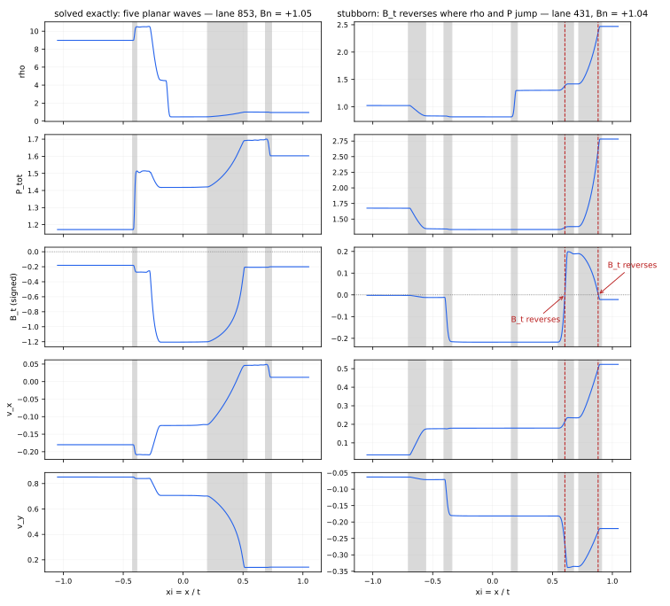

# What we solve, how, and how much

Written 2026-09-09. Every number here is measured, and the command or file
behind it is named. Companion to `planar_solver_notes.md` (which documents the
five-wave solver itself) and `numerical_setup_notes.md` (the scheme).

The runs referred to throughout:

| run | flux | resolution | note |
|---|---|---|---|
| `rotor_64_exact` | exact, seven-wave only | 64² | 1,112,611 attempted interfaces |
| `rotor_64_p5` | exact, + five-wave planar | 64² | 284 steps, 11.1 h on calea01, \|divB\| < 7.4e-13 |
| `rotor_{64,128,256}_hlld` | HLLD | — | references |

---

## 1. What "solve" means here

A flux is called **exact** if and only if the state behind it satisfies the
**complete seven-wave jump conditions to 1e-8**, verified per interface. Not
"the solver converged", not "the solver reported success" — the answer is
checked against the full residual `fullfuncv6`, in the frame it was produced
in, and only then counted.

This definition is what makes the whole hierarchy below legitimate. A reduced
solver is admissible on exactly the same terms as the full one, because wave
count stops being the criterion and the residual becomes it. It is also
falsifiable from the harvest, which is the point.

It bites. The reduced **three-wave solver** (two fast waves and a contact,
slow waves dropped) converges on essentially every interface including all the
hard ones, and **0.0% of its answers reach even 1e-6** on the full residual;
the median is 1.2e-2. It is a reliable approximation and not a solution, and
it stays switched off.

By contrast the seven-wave solver's own harvested answers verify at
**99.92%** (5,193 of 5,197 sampled), median residual 3.7e-10.

> *Provenance.* Verification reconstructs the six unknowns from the stored
> zones. That reconstruction was validated before use by testing three sign
> conventions: `phi = psi(R3) - psi(R2)` verifies 99.90% at 1e-8, the negated
> convention 66.06% with 23.8% unconstructible, and zeroing the rotations
> 81.45%. The first is therefore correct, and the coverage numbers below rest
> on it.

---

## 2. What the flow actually is

Before choosing a solver it is worth knowing what the rotor presents. Census
over 5,197 interfaces whose exact solution we hold, counting waves that carry
a jump above 1e-6:

| waves carrying a jump | share |
|---|---|
| 4 | 1.48% |
| **5** | **93.46%** |
| 6 | 3.04% |
| 7 | 2.02% |

Per family: LF 100.0%, LA 3.3%, LS 100.0%, CD 98.5%, RS 100.0%, RA 3.9%,
RF 100.0%.

**The rotor is a five-wave flow.** Both fast and both slow waves fire on
essentially every interface and the contact on 98.5%; only the rotational
discontinuities routinely go silent. The 1.48% at four waves are interfaces
with no contact jump, not missing rotations.

This is threshold-dependent and must be quoted with its threshold. At 1e-3
instead of 1e-6 the same population reads 0.02% / 0.13% / 0.73% / 8.52% /
87.84% / 1.14% / 1.62% for 1–7 waves, as weak contacts and weak fast waves
fall below the bar. *How many waves* is a property of the flow **and** of the
strength one counts as present.

Wave types, over 400 interfaces: the fast waves are shocks 64.0% (left) and
63.2% (right) of the time, the slow waves only 14.8%. Most slow waves are
rarefactions.

### Why five: coplanarity

A two-dimensional flow keeps field and velocity in one plane. Measured,
`chi = |Bt_L x Bt_R| / (|Bt_L||Bt_R|)` has median **7.6e-11** and is below
1e-6 on **99.965%** of interfaces; on every interface at most one solver-frame
tangential component exceeds 1e-6.

In that geometry a rotational discontinuity can only do **nothing or reverse**,
because 0 and π are the only rotations carrying the common line to itself.
The Alfvén family's continuous degree of freedom collapses to a binary choice,
which is what makes the reduction possible.

But it is a **degenerate limit, not a robust one**, and the data says so.
Over 142,554 rotation angles (both sides of 71,277 interfaces): 97.3% below
1e-6, **0.375%** within 1e-3 of π, and **2.3% strictly in between**. Those
intermediate ones sit on interfaces that are 57× less coplanar — chi median
4.3e-9 against 7.6e-11 overall. A departure from coplanarity of one part in
1e9 is enough to unpin the angle, and 0.27% of rotations exceed 0.1 rad: an
O(1) response to an O(1e-9) perturbation.

> This supersedes the earlier claim that "2.3% carry a π". The 2.3% is right
> for *any* nonzero rotation; only 0.375% are near π. The bulk of the tail is
> small angles produced by roundoff-level non-coplanarity, which is different
> physics and matters for what the five-wave family can represent.

---

## 3. How we solve it

### The seven-wave solver

Six unknowns `[ln p_LF, ln|Bt_CD|, psi_CD, ln p_RF, phi_L, phi_R]` against six
residuals: four contact jumps plus **two slow-wave slacks**. The slacks exist
because each slow wave is prescribed *both* tangential components — two
numbers — while the wave family has one parameter.

On a planar flow this is ill-posed in three separate ways, each measured:
`psi_CD` is fixed by geometry (a planar slow wave turns the field by a median
6e-12 rad, so that Jacobian column is finite-difference noise); the slow waves
are over-determined and fail to construct rather than returning a large
residual; and the Alfvén and slow speeds differ by a median 5.5e-3 against
2.8e-1 separating fast from Alfvén.

It needs a neural warm start and a retry ladder, and it resolves **43.3%** of
attempted interfaces.

### The five-wave planar solver — a genuinely reduced Newton

Three unknowns `[ln p_LF, Bt_CD, ln p_RF]` against three residuals
`[[vx]], [[vt]], [[P_tot]]`. This is not the same Newton with variables
frozen:

| | seven-wave | five-wave planar |
|---|---|---|
| unknowns | 6 | 3 |
| residual | 4 jumps + 2 slacks | 3 jumps |
| Jacobian | 6×6 | 3×3, probes stacked into the batch |
| warm start | network + retry ladder | mean pressure, mean field |

The **slack equations do not exist** in the reduced form — each slow wave is
handed exactly one signed number, its family's dimension. The reduction
removes three unknowns and two equations together, and the three it removes
are precisely the ill-posed ones.

`Bt_CD` is signed and enters linearly, so a field reversal is an ordinary sign
change through zero instead of a discrete branch.

One implementation detail matters on this population: `planar5_b.jacobian`
falls back to a **backward** difference wherever the forward probe leaves the
feasible set. Only ~6–8% of the natural box is constructible, so a naive
forward difference would poison whole Jacobian columns.

### Six and seven waves: branches, not dimensions

A π reversal is applied to the post-fast state *before* the Newton, as the
`flip=(bool, bool)` argument. So the 6-wave case runs on the **identical 3×3
Newton**; six waves costs no extra dimension over five. That is the payoff of
coplanarity — a binary rotation is a branch, not a variable.

### Four and three waves need no solver at all

A solution with a silent family is a **limit** of the richer family, not a
separate structure: the five-wave solver returns zero strength for a wave that
does nothing. `rmhd_final/tests/batched/test_degenerate_structures.py` pins this — a pure
entropy wave gives *exactly* zero residual, not merely a small one, and the
`nochange` branches of `fast_wave` and `slow_wave6` are what make it exact
rather than lucky.

**Only the rotation needs its own branch**, because a π reversal is a discrete
jump, not a continuous limit of no rotation. That is the real dividing line in
the hierarchy.

---

## 4. How much gets solved

### The hierarchy, cumulative

12,000 interfaces sampled from `rotor_64_exact` in the true solved/failed
proportion; every accepted answer verified at 1e-8.  So the first row,
43.28%, is this SAMPLE's value of the 43.9% the whole run counts (the
production coverage quoted elsewhere); both are fractions of attempted
interfaces.

| structure allowed | new | cumulative | % of attempted |
|---|---|---|---|
| 7-wave solver (production, verified) | 5,193 | 5,193 | **43.28%** |
| + 5-wave planar, default seed | +4,152 | 9,345 | **77.88%** |
| + 5-wave planar, sqrt(2P) retry | +211 | 9,556 | **79.63%** |
| + 6-wave, left rotation = π | +29 | 9,585 | 79.88% |
| + 6-wave, right rotation = π | +16 | 9,601 | 80.01% |
| + 7-wave, both rotations = π | +9 | 9,610 | **80.08%** |

**All together: 80.1% of attempted interfaces.**

The measurement validates itself: 7-wave + 5-wave at the default seed gives
77.88%, against **78.0%** obtained independently from the production run's
coverage bitmasks (`scripts/harvest_summary.py`). Agreement to 0.12 points by
two different routes.

Three readings:

- **The planar solver is the workhorse**, +34.6 points, nearly doubling
  coverage.
- The **sqrt(2P) retry** adds a real but modest +1.75 points. It is a *retry*,
  never a replacement: as a replacement that seed loses 1,749 of 3,619
  controls, because the two seeds have largely disjoint basins.
- The **flip branches buy almost nothing** — +0.45 points for all three, 54
  interfaces in 12,000. The census says 5% of interfaces carry a rotation, but
  those are ones the seven-wave solver already handles; rotations are what it
  is good at. **Not worth wiring into the fallback ladder.**

### In terms of the whole grid

Per-direction figures are per-direction; they must not be summed and then
treated as a fraction of all interfaces.

| | x-sweeps | y-sweeps | both |
|---|---|---|---|
| interfaces | 3,997,584 | 3,997,584 | 7,995,168 |
| attempted | 13.8% | 14.4% | **14.1% of all** |
| exact | 12.5% | 9.5% | **11.0% of all** |
| exact / attempted | 90.9% | 65.7% | **78.0%** |

So:

- **78.0% of attempted** in production as it stands = **11.0% of all interfaces**
- **80.1% of attempted** with the full hierarchy = **11.3% of all interfaces**
- **85.9% of interfaces are never attempted**: they fall under the weak-jump
  gate and take HLLD, by design, because the flux barely matters where the
  jump is negligible.

The exact solver supplies about **one interface in nine**.

The y-sweeps are much weaker than the x-sweeps (65.7% against 90.9%), which is
where the normal field is small. (`planar_solver.tex` first quoted 83.9% for
the y-sweeps, from a pilot of this run; it now states the finished run's
**65.7%**.)

---

## 4b. The gate: why 85.9% is never attempted

The gate is one line — `relative_jump(sL, sR) < tau_weak`, with
`tau_weak = 1e-2` in production — and everything below it takes HLLD.

`relative_jump` is not a naive measure. rho and p use ordinary relative
differences (strictly positive), velocity an absolute VECTOR jump (bounded by
1, already dimensionless), the field a vector jump against a pressure-floored
scale; vector norms rather than per-component maxima also make it
rotation-invariant. The reason is in its docstring: the obvious form has a
denominator that vanishes at a zero crossing, and since the rotor is a
ROTATING flow where vx, vy and By cross zero across most of the domain, that
form called **99.9%** of interfaces discontinuous at 1e-2 and the gate could
never fire.

**Why a gate is mandatory: cost.** The exact solve is ~30 ms per interface
against microseconds for HLLD. The run does ~8M interfaces per step over 284
steps; at 14.1% attempted it took 11.1 h, so ungated it would be roughly 7x
that before the failures burn their retry ladders.

**And it discards where the flux matters least** (dF = |F_exact - F_HLLD| /
|F_HLLD|, from harvested exact answers against HLLD on identical inputs):

| relative_jump | n | median dF | p90 dF |
|---|---|---|---|
| 0.01 - 0.03 | 1351 | 2.280e-04 | 3.946e-03 |
| 0.03 - 0.1 | 1370 | 5.328e-04 | 1.347e-02 |
| 0.1 - 0.3 | 560 | 0.000e+00 | 2.495e-02 |
| 0.3 - 1 | 719 | 6.622e-02 | 3.580e-01 |

Everything harvested is ABOVE the gate, so there is no direct measurement
below 1e-2; the trend supports extrapolating but that has not been measured.

### But keying on the jump ALONE is demonstrably not the best gate

Six candidate predictors of dF, Spearman rank correlation over 4000
interfaces. The jump is the best single one, but only just, and 0.41 is loose:

| predictor | rho_s |
|---|---|
| **relative_jump (the gate)** | **+0.414** |
| contact strength | +0.381 |
| \|B_n\| | +0.302 |
| \|Bt_L\|/\|B_n\| | -0.227 |
| sigma | +0.206 |
| slow-wave strength | +0.184 |

The gate ignores |B_n| entirely, though median dF rises from 1.8e-4 below
|B_n| = 0.1 to 8.7e-3 above 1. The concrete cost:

| | share |
|---|---|
| exact flux BITWISE identical to HLLD (dF < 1e-14) | **31.95%** |
| ray returns a pure upwind state (fan entirely on one side) | 38.10% |
| ... of those, identical flux | 83.86% |
| median dF over the non-upwind remainder | 4.055e-03 |

**Nearly a third of the interfaces we pay ~30 ms to solve return a flux HLLD
already produced.** They are supersonic: the whole fan sits on one side of the
ray, so the exact answer IS the upwind flux, which HLLD gets by construction.

**The fix, now implemented.** HLLD's signal speeds are clamped at zero, so
`cmin == 0` means every wave is right-going and its flux is f_L exactly;
`cmax == 0` gives f_R. `RMHD_UPWIND_SKIP` (default **on**) skips those, and
`n_upwind_skip` reports them.

Measured on 3,000 recorded interfaces sampled in the run's true
solved/failed proportion:

| | skip OFF | skip ON |
|---|---|---|
| attempted | 3000 | 1962 |
| upwind-skipped | 0 | 1038 (**34.6%**) |
| wall time | 91.41 s | 57.33 s |
| **speedup** | | **1.59x** |
| worst relative flux change | — | **7.6e-16** |

Regression: the full suite is 7 failed / 110 passed / 2 skipped, exactly the
known pre-existing baseline. `tests/test_upwind_skip.py` (5 tests) holds the
contract.

**A bookkeeping consequence to be aware of.** `n_exact` falls from 2273 to
1400, because a skipped interface receives the exact flux but is not *labelled*
exact. Reported coverage drops from 75.8% to 71.4% of attempted with no change
whatever in the physics. Whether skipped-upwind interfaces should be counted
as exact — they do receive the exact flux, to 1e-16 — is a reporting decision
that has not been made.

### What the gate discards, measured directly

The harvest cannot answer this (everything in it is above the gate), so:
shrink a real discontinuity by a factor s about the mean state, keeping both
endpoints physical, and solve with the gate opened to 1e-14.

| s | median jump | median dF | p90 dF | max dF | exact% |
|---|---|---|---|---|---|
| 1 | 4.57e-02 | 1.81e-04 | 1.23e-01 | 9.99e-01 | 95.5% |
| 0.3 | 1.37e-02 | 3.55e-05 | 1.31e-02 | 1.37e-01 | 94.1% |
| 0.1 | 4.57e-03 | 1.06e-05 | 2.16e-03 | 2.71e-02 | 95.4% |
| 0.03 | 1.37e-03 | 2.42e-06 | 4.57e-04 | 6.41e-03 | 96.8% |
| 0.01 | 4.57e-04 | 8.33e-07 | 1.54e-04 | 1.98e-03 | 97.0% |
| 0.003 | 1.37e-04 | 2.48e-07 | 4.56e-05 | 5.78e-04 | 97.0% |
| 0.001 | 4.57e-05 | 8.04e-08 | 1.43e-05 | 1.91e-04 | 96.8% |

dF scales as roughly `jump^1.1` — near-linear, no floor. At the production
threshold (jump = 1e-2) the interpolated median difference is ~2.5e-5 with a
p90 near 7e-3, and it falls away steadily below that.

**So the gate is justified.** The attempted population has median dF 3.7e-3
and moves the solution by 0.5%; the gated population's differences are ~100x
smaller while being ~6x more numerous, which scales to roughly **0.02%** —
negligible against a 32.8% resolution gap, for ~6x the compute. That is a
scaling argument from measured quantities, not a run comparison; measuring it
directly means a `tau_weak = 0` run, which has not been done.

## 5. How much does not

**19.9% of attempted interfaces get no exact flux** — about 2.8% of all
interfaces. What is known about them:

- **Not a seed problem.** A 7³ scan of the three-unknown box finds a feasible
  starting point for 100% of them; starting the Newton from the best such
  point converges on 8.5%. Feasibility is necessary and nowhere near
  sufficient. Retry ladders saturate abruptly — at ±2 and ±4 sqrt(2P) the gain
  is *exactly zero*, which is what a feasibility boundary looks like rather
  than a convergence basin.
- **Not the Alfvén/slow degeneracy.** This was proposed and **refuted**:
  failures are *farther* from coincidence than successes (median gap 7.9e-3
  against 3.3e-3 of the fast-wave span), and interfaces within 1e-3 of
  degeneracy succeed *more* often, 33.8% against 20.7%.
- **Field reversal is a real but narrow signal.** A tangential field that
  reverses raises the odds of failure by **3.67×**, monotonically with the
  normal field (2.36, 3.21, 3.05, 5.03, 8.13 across |Bn| bins). That is the
  Brio–Wu configuration, where coplanar compound waves are known to arise. But
  reversal covers only **2.8% of failures**.
- **The bulk sits at small normal field and large tangential field** —
  |Bt|/|Bn| median 1.41 failing against 0.76 succeeding — which is also where
  the solver is hardest for ordinary numerical reasons. The two explanations
  are confounded and the harvest cannot separate them.

### Brute force, run fairly (2026-09-09) — the strongest evidence we have

Asked directly: it must be possible to solve these, even by brute force. It
was a fair challenge, and the three previous searches were all unfair to the
method in specific ways:

- **a grid alone cannot approach a root.** Its nearest point is half a
  spacing away, so its best residual is ~||J||*delta whether or not a root
  exists. Measured: at 7³ the CONTROL group (roots known) plateaus at
  1.39e-1, essentially the same as the stubborn group's 1.62e-1. The residual
  is worthless as a discriminator; only Newton convergence from those points
  separates them (70% vs 0%).
- **a descent alone stalls**, because the residual is a CONSTANT sentinel
  wherever the structure will not construct, so a start outside the feasible
  set has zero gradient and never moves.
- **every search assumed the rotation is 0 or pi** — angle enumeration, the
  grids, the tube-frozen angles, the planar descent. But the rotor is coplanar
  only to chi ~ 1e-10 and 2.3% of measured rotations are intermediate, so a
  solution with an intermediate rotation was not representable by any of them.
  (Freeing the rotations turned out to matter for a different reason than
  this paragraph expected — see the correction of 2026-09-12 below.)

Doing all three properly — grid to locate the feasible set, 24 least-squares
descents from it, rotations FREE, objective = the full six-component residual
so anything found is exact by construction:

**The box has to be sized from data, not from physics intuition.** The first
run used +-2 in ln around ln(P_bar) for the pressures and ln(sqrt(2 P_bar))
for the contact field. Checked against the CONTROL group's known answers,
that box misses **35.6%** of them: the pressures never stray beyond 0.93 of a
half-width, but ln|Bt_CD| needs 7.5 for p99 and 11.9 for all, and its true
centre sits e^1.26 ~ 3.5x above sqrt(2 P_bar). Re-run with half-widths 1.5
(pressures, 11 pts) and 9.0 (field, 61 pts), equal spacing 0.30 everywhere:

| | feasible grid pts | best full \|\|f\|\| (median) | zero residual (1e-8) | rotations found |
|---|---|---|---|---|
| **CONTROL** (root known) | 5854 | **3.38e-14** | 90.0% | 0: 92%, pi: 3%, intermediate: 6% |
| **STUBBORN** | 5243 | **1.52e-02** | 5.0% | 0: 50%, intermediate: 50% |

(the undersized box gave 82.5% / 5.0% — it handicapped the control group by
7.5 points.)

**These two rates are UNGATED and the rotation column is wrong — see the
2026-09-12 correction below before citing either.** What survives: the
instrument drives known roots to machine precision (3.4e-14) while the
stubborn set stalls twelve orders of magnitude higher, and three confounds
are closed:

- **not feasibility** — the two groups have comparable feasible sets;
- **not resolution** — the descent proved it has no floor by hitting 1e-14;
- **not the box** — it is now sized so the known answers fit inside it.

### A zero residual is not a solution (2026-09-12) — the rotation result retracted

This script never applied the wave-order gate that `exact_flux.py`
(`RMHD_WAVE_ORDER`) and `rescue_collect.py` do, and it stopped at the first
zero residual. Re-gating the four completed 1280+1280 runs of 2026-09-10/11
(30 descents, `HLLD/results/brute_*`) with the same rule — a rotational
discontinuity that crosses its slow wave while carrying a jump, or any other
inversion, is a self-crossing fan, not a solution:

| box | CONTROL raw → admissible | STUBBORN raw → admissible |
|---|---|---|
| global, field [-16, +2] | 88.36% → **76.25%** | 7.66% → **4.06%** |
| HLLD-centred | 89.30% → **78.91%** | 8.98% → **3.91%** |
| rebalanced 5/300/5 | 81.56% → 71.56% | 7.73% → 4.06% |
| rebalanced, HLLD-centred | 85.94% → 76.41% | 7.58% → 3.75% |
| **union of the four** | 92.34% → **83.75%** | 10.16% → **5.08%** (65/1280) |

Three consequences.

1. **The stubborn rate was inflated 2x.** 47–57% of the stubborn "roots" were
   fans. Gated, the four boxes tie (paired McNemar p = 0.81, 1.0, 0.81) at
   3.75–4.06%, and the union is 5.08% — the ceiling every earlier search hit.
   The apparent win of the HLLD-centred box (p = 0.006 ungated) was fans.
2. **"Half need an intermediate rotation" is retracted.** Of the
   intermediate-rotation "solutions", **83–93% were fans**. The survivors live
   at |Bt_CD| ~ 1e-2–1e-3, 100–350x weaker than the 0/pi solutions, where the
   residual is ~4,000x less sensitive to the angle (perturbing phi_L by 0.1
   rad moves it to 3.7e-5 against 1.1e-1 on a strong-field row). An
   intermediate angle there is what a weakly determined unknown looks like,
   not evidence for a non-coplanar solution family. Among ADMISSIBLE
   solutions the split is 2.6–2.9% intermediate on controls and 4–12% on
   stubborn (2–6 interfaces of ~50), and the admissible stubborn roots have
   ordinary field strength (median ln|Bt_CD| −0.42 / +0.02 against +0.04 for
   controls) — the weak-field ones were the fans. The singular-limit
   hypothesis loses this support; it keeps the 3.67x reversal odds ratio and
   nothing else from this section.
3. **The jump conditions have more than one root, and admissibility selects.**
   On 11–12% of CONTROL interfaces — where an admissible root is known and the
   harvest itself is only 1.9% inadmissible — the descent converged to a
   different, inadmissible root and then stopped. This does not contradict
   §5b (which compared admissible answers with each other), but it sharpens
   it: uniqueness is a statement about admissible solutions, and any search
   that stops at a zero residual can be stopped by the wrong root.

The gate is now inside the descent loop (`_admissible`); a fan is skipped and
the remaining descents continue, and `*_best_raw` keeps the ungated number
for the record.

**A grid refinement study agrees.** Best residual over 7³ → 13³ → 25³
(2744 → 125,000 points): the control halves cleanly (1.92x, 1.93x) as
||f|| ~ ||J||*delta requires; the stubborn group's rate decays (1.85x, 1.58x).
Fitting ||f|| = c + k*delta gives a floor c ~ 0.0024 for the control
(consistent with zero) and **c ~ 0.023 for the stubborn set**, ten times
larger. Extrapolation from three points, so a signal rather than a proof —
but the control behaved exactly as it should, which none of the earlier
attempts managed.

**Verdict.** Brute force works, and it says most of these interfaces have no
admissible elementary-wave solution. This is still not a proof — a descent
can stall in a local minimum of ||f||², it demonstrably stops at inadmissible
roots, and 5% did turn out to be solvable — but it is the first argument here
whose instrument was validated on a control group before its conclusion was
drawn, and the 2026-09-12 gating is the second time that control group caught
the instrument lying.

### Can we prove they are unsolvable? No — three attempts

1. **Per-component sign certificate.** A root needs all three residual
   components zero at one point, so one component keeping a single sign over
   the whole feasible set proves no root. Sound in principle; at 48³ over the
   physically bounded box it produced **2/6 false certificates**, because only
   ~6% of that box is constructible and sign changes were missed. Re-run
   adaptively with 20k–30k feasible points: **0/15 stubborn and 0/15 control**.
   Withdrawn.
2. **Counting unconstructible branches as "no root".** Unsound. A branch that
   will not construct is a Newton failure inside `alfven_checked`, not a
   non-existence result.
3. **Combinatorial degree** (cells whose eight corners realise all eight sign
   patterns). **Fails its own validation gate: 0/12 controls**, which provably
   have roots. At 56³ a cell is ~0.5 wide in Bt while a root must be localised
   to ~1e-6.

**The general lesson: grid methods cannot settle this.** It is 3D root
localisation where the root, if it exists, occupies a vanishing fraction of
the box. What could still work: *homotopy continuation* (track the root from a
solvable neighbour; a fold would be evidence of non-existence with a
mechanism), and the high-resolution *tube test*, which would exhibit what the
solution **is** rather than proving what it is not.

### Homotopy continuation, run (2026-09-20) — a rescue, and no fold

`scripts/coplanar_limit.py` does what the paragraph above asks for. Every
interface is coplanar to ~1e-11, so it is tilted out of its plane: in the
planar frame the left tangential field is rotated by +eps and the right by
-eps at fixed |B_t|, rho, gas pressure and velocity, which makes an ordinary
FULL7 problem of it. The solution is then followed down a ladder
eps = 1e-1 ... 1e-6, each rung warm-started from the one above and a failed
rung re-walked in 2, 4 then 8 sub-steps, and finally polished at eps = 0.
An answer counts only if it passes what production requires: full seven-wave
residual <= 1e-8 **and** the waves in order.

**The population had to be re-measured first.** The lanes come from a 64^2
harvest that predates the Alfven sign fix (rmhd_final d09ffe2), so each one
was first re-run through today's production path: **276 of the 1280
"stubborn" interfaces (21.6%) are simply solved now** — 78 by the seven-wave
Newton, 230 by the planar solver. Every stubborn number measured before
2026-09-20, including the brute-force ceiling above, carries that
contamination.

**Validation gate**, on the 1219 control lanes the planar solver verifies:
the difference to the planar answer falls linearly in eps (median 2.68e-2 at
1e-1 to 2.68e-7 at 1e-6), the eps = 0 polish verifies on 94.8% of them and
agrees with the planar answer to a median 4.7e-11. The rate at which a
control is dragged onto a different branch and ends up labelled "singular" is
0.25%, which is the noise floor for the stubborn classification below.

**The 1004 genuinely stubborn lanes** (calea job 631, 2560 lanes, 2 min):

| class | share | what it means |
|---|---|---|
| NOSTART | 83.2% | not solvable even tilted, at any eps from 0.03 to 1 rad |
| LOST | 12.7% | the branch is lost below some eps*, with **kappa(J6) unchanged (ratio 1.00 on every lane)** |
| SINGULAR | 0.3% | = the control artifact rate; no signal |
| EXACT0 | **5.1%** | 51 verified exact answers, 50 with rotations at {0, pi} |

Two conclusions, both negative for the original hope and one useful:

* **No fold.** A fold would show as the Jacobian's condition number diverging
  as eps -> eps*; it does not move at all. The lost lanes are Newton
  failures, not a branch ending. So continuation does **not** supply the
  non-existence argument.
* **Coplanarity is not the obstacle.** kappa stays ~12-21 down to eps = 1e-6,
  so the angle unknowns are observable at finite |B_t| (only |B_t| -> 0 loses
  them), and tilting a stubborn interface by up to 1 rad leaves 67-78% of
  them unsolvable. Whatever makes them hard survives leaving the plane.
* **But it rescues 5.1%** that production misses, concentrated at
  |B_n| in [0.01, 0.1) (34% of that bin). Brute force finds 23 further lanes;
  together 74 of 1004 (7.4%), consistent with the ~5% admissible ceiling
  measured above.

The open question is therefore the 83% that cannot be started at all, which
is a basin question rather than a geometry one, and the tube test below.

### The tube test, run (2026-09-20) — the structure is not in the family

`scripts/tube_features.py` answers the question the Newton cannot: it evolves
each interface as a 1D shock tube (`src/physics/tube_seed.run_tubes`), which
solves the PDE and therefore shows the real structure whatever the solver can
represent. Two resolutions are run so a feature counts only when it appears
in both; speeds are read in the similarity variable xi = x / t; each feature
is assigned to a wave family by comparing its speed with the seven
characteristic speeds on either side of it. 351 interfaces (calea job 673),
100 per group drawn from item B's classes.

**Counting features answers nothing**, and the reason is worth recording. The
detector resolves waves of strength >~1e-2 -- it finds 2.91 confirmed features
per lane against 2.89 waves above 1e-2 in the known answers, and 4.47 above
1e-3 -- but the seven characteristic speeds are routinely crowded inside 0.02,
so neighbouring waves merge into one feature and a per-wave assignment is only
21-40% reliable. Doubling the resolution (1024 + 2048) changes nothing:
features per lane 2.87 -> 3.03 on controls, and the single "two features in
one family" seen at the coarser pair disappears. **No lane in any group shows
two features in one family.** The spec's compound-wave test comes back empty.

**Asking what each feature IS answers it.** The elementary family allows only
two kinds of jump: a rotational discontinuity turns the tangential field and
leaves rho, P_tot and |B_t| alone, and a magnetosonic wave changes them
without turning the field. So test every feature against that:

| group | reversal + magnitude jump | \|B_t\| -> 0 inside a feature | rotation only |
|---|---|---|---|
| control (the solver answers these) | **2.0%** | 10.0% | 0.0% |
| stubborn, ladder never starts | **61.0%** | 83.0% | 5.0% |
| stubborn, ladder lost | **78.0%** | 86.0% | 2.0% |
| stubborn, rescued at eps = 0 | 23.5% | 39.2% | 0.0% |

The stubborn interfaces carry a **field reversal through |B_t| = 0 fused to a
density and magnitude jump** -- a compound or intermediate wave. The seven-wave
system has no root for it by construction: neither of its two jump types can
do this. The 2% on controls is the test's own false-positive rate, and the
lanes item B rescued sit in between at 23.5%, which is what they should do,
being the ones that DO have an elementary root.

Two supporting numbers point the same way. The seven-wave residual evaluated
at the structure read straight off the profile is 2.5e-2 on controls against
1.7e-1 and 2.4e-1 on the two stubborn groups; and handing that read to the
Newton finishes 79-82% of controls against **2%** of the never-starting
stubborn lanes.

**So the answer to section 5's question is: the solver fails on these
interfaces because their solution is not in the family it searches.** Not a
seed, not conditioning, not coplanarity -- all three were tested and cleared
above. Figures for individual lanes (`scripts/plot_tube_profiles.py`, written
to the git-ignored `figs/tubes/`; the committed one is below) show it directly: lane 1187 reverses the
field twice while |B_t| dips to zero, lane 1519 does it inside a single slow
wave, and v_z stays at 1e-14 throughout, so these are planar problems.

Caveats, so the claim is not overread: the detector is blind below ~1e-2 in
strength, the groups are 100 lanes each (so a percentage carries about +-5),
and a compound wave is identified by what its jump violates, not by resolving
its internal structure.

**Over the whole population, not a sample** (calea job 721, every one of the
1004 still-stubborn lanes plus 300 controls, at 256 + 512 cells): the reversal
fused to a jump appears on **58.8%** of the lanes the ladder cannot start and
**68.0%** of those it loses, against **4.3%** of controls. The control rate is
higher than the 2.0% measured at 512 + 1024 cells, as a coarser screen should
be; the stubborn rates agree with the 100-lane sample within its +-5.

*Left: lane 853, an interface the solver answers exactly -- five planar
waves, the two rotations silent, and B_t never changes sign. Right: lane 431,
a stubborn interface at almost the same normal field (B_n = +1.04 against
+1.05). At xi ~ 0.6 the tangential field flips from -0.22 to +0.20 exactly
where rho, P_tot, v_x and v_y all jump (red dashed line), and it crosses zero
again inside the right-going fast rarefaction. Grey bands are the detected
features. Lane 431 was chosen as the clearest of the whole screen (job 724
re-ran the eight best candidates and a matched control each at 512 + 1024
cells); the title says only what is visible, because at this resolution a
fused wave and a pi-rotation riding exactly on the slow wave look the same.
Either way no admissible elementary root exists: brute force, which
enumerates every rotation including pi, found none. PDF for the paper:
`figs/compound_wave_pair.pdf`.*

### Where the stubborn population stands (2026-09-21)

Of the 1280 interfaces that were stubborn in the pre-fix 64^2 harvest:

| | lanes | share |
|---|---|---|
| solved by today's production path (seven-wave 78, planar 230, both 32) | 276 | 21.6% |
| + an exact answer from the eps-ladder (item B) | 51 | |
| + from brute force, B_n >= 0 only | 21 | |
| + from the tube read handed to the Newton (item C) | 12 | |
| **exact today, by any method** (the three rescues overlap; union 68) | **344** | **26.9%** |
| left without an exact answer | 936 | 73.1% |

Brute force found 13 further roots on B_n < 0 lanes, but it ran with the
sign-swapped Alfven speeds, so those roots are not verified under the fixed
solver and are not counted. Of the 936 left, 933 were screened by the tube
test and **60.0%** carry the reversal fused to a jump -- the structure the
seven-wave family cannot hold. The eps-ladder, brute force and the tube seed
are measurement tools; none runs in production, and turning any of them into
a production rescue would need its own paired rotor replay.

---

## 5b. Is the answer UNIQUE?  Yes on the measured population — but the residual is a weaker certificate than it looks

A zero residual proves the answer is *an* admissible elementary-wave
solution. MHD does not promise only one, and nothing in the code had ever
checked. Two independent comparisons, both on the FULL answer (every zone,
every speed) rather than on the star pressure alone.

**Test 1 — two planar seeds with largely disjoint basins.** The default seed
and `+sqrt(2P)` reach different lanes (the second loses 1749 of 3619
controls), so where both converge they are independent routes to the answer.
On 2525 such lanes:

| | median | p99 | max | above 1e-8 |
|---|---|---|---|---|
| all four zones (physical scales) | 7.7e-12 | 4.1e-10 | 9.3e-10 | **0** |
| all five wave speeds (absolute) | 6.8e-13 | 8.7e-11 | 1.2e-09 | **0** |

Not one lane above 1e-8. Within the planar family the solution is unique to
solver tolerance.

**Test 2 — the seven-wave solver against the planar one**, on 5095 lanes
where the harvested answer carries no rotation and the planar solver
verifies. Here they do NOT always agree: median 4.3e-10, but **102 lanes
(2.00%) differ by more than 1e-6**, up to 9.2e-4 — and on all 102 *both*
answers pass the full seven-wave residual at 1e-8.

That looks like non-uniqueness. It is not. **It is conditioning**, and the
numbers say so:

| | routes agree | routes differ |
|---|---|---|
| planar 3x3, kappa | 8.0 | 12.7 |
| **seven-wave 6x6, kappa** | **32** | **7.9e+03** |
| harvested residual | 1.8e-10 | 5.1e-09 |

The seven-wave Jacobian is 246x worse conditioned on exactly the lanes that
disagree, and `kappa_7 x residual` predicts a state spread of 1.79e-5 against
1.13e-5 observed — the same order, the prediction slightly conservative. The
planar 3x3 kappa is ~10 on both groups and predicts 1.3e-7, 89x too small.
So the two routes find the SAME root; the seven-wave parameterisation merely
localises it ~250x more poorly there. (kappa_7 reaches 1.0e10 on the worst
agreeing lane, so this is not a tail effect — it is the coplanar
ill-posedness the planar solver was built for, showing up in the certificate
rather than in the convergence.)

**Three consequences, and they matter for the paper.**

1. **Uniqueness is supported** on the measured population — no evidence of a
   second admissible elementary-wave solution anywhere in 7620 compared
   lanes.
2. **"Verified at 1e-8" is a statement about the residual, not the state**,
   and the conversion factor is the parameterisation's condition number. In
   the planar form a 1e-8 residual pins the state to ~1e-7; in the seven-wave
   form, on 2% of coplanar lanes, only to ~1e-4. The paper must say which.
3. **This is an independent argument for making the planar solver primary**
   (Sect. 4's plan item): not merely 4x cheaper and needing no warm start,
   but a materially better-localised answer on the population the rotor
   actually presents.

## 5c. A gap in the definition: the jump conditions do not order the waves

Verification checks that the state behind the flux satisfies the seven-wave
jump conditions. It does NOT check that the seven waves are ordered in space,
and they are not always: a fan whose Alfven wave sits to the right of its slow
wave is self-crossing and is not a Riemann solution however small its
residual.

Measured over 24,632 production rows, separating the harmless case from the
real one -- a crossing between ZERO-strength waves changes nothing, because no
state depends on where a wave with no jump sits:

| | production | rescued (planar path) |
|---|---|---|
| LA carries a jump | 5.6% | 0.0% |
| LA crosses LS | 10.0% | 89.8% |
| **crossing AND carrying a jump** | **2.52%** | **0.03%** |
| usable | 97.48% | 99.88% |

So **2.52% of interfaces counted as verified-exact in production are
inadmissible fans.** The rescued rows are almost all clean despite crossing
far more often, because the planar path leaves both rotations at zero strength
by construction.

**Both paths now gate on it.** `scripts/rescue_collect.py` and the production
`exact_flux_batched` (`RMHD_WAVE_ORDER`, default on, reported as
`n_wave_order_rejected`). Measured on 3000 real interfaces in the run's true
solved/failed proportion:

| | gate off | gate on |
|---|---|---|
| n_exact | 1248 | 1215 |
| rejected as self-crossing | 0 | **33 (2.64%)** |
| coverage of attempted | 66.70% | 64.94% |

The rejected lanes' fluxes change by a factor of order 500 when they fall back
to HLLD. These were not marginally wrong, they were nonsense --- which is what
a self-crossing fan should produce --- and the residual check passed every one.

**Re-measured 2026-09-10 (`rotor_64_p5wo`, 284 steps, one variable changed).**
The central result is unaffected and is safe to cite:

| A | B | L1(rho) at t = 0.4 |
|---|---|---|
| rotor_64_hlld (no exact flux) | rotor_128_hlld | 3.284e-01 |
| rotor_64_p5 (gate off) | rotor_128_hlld | 3.275e-01 |
| **rotor_64_p5wo (gate on)** | rotor_128_hlld | **3.278e-01** |

0.03 points of 32.8, marginally the wrong way. Removing the bad fluxes does
not rescue exact-at-N ~ HLLD-at-2N.

**The gate pays on a different metric.** Symmetry error -- the drift from a
symmetry the rotor's initial condition genuinely has -- improves **6.8x**:
final 1.089e-02 with the gate against 7.391e-02 without (max over the run
6.77e-02 against 8.45e-02). That is what deleting fluxes wrong by ~500x on
2.6% of interfaces should do: almost nothing to an L1 norm measured against a
reference 33% away, and a visible reduction in the scheme's own
inconsistency. It is the better argument for the gate than coverage is.

## 6. Are the waves resolved properly?

Two integrations, and only one of them is certified by the residual.

**The fan endpoints are certified.** `fast_wave` and `slow_wave6` integrate
through the rarefaction to reach the post-wave state, and that state is what
the jump conditions test. A residual of 1e-10 certifies the endpoint to that
tolerance.

**The fan interior is a separate code path** — `ray_b.state_at_xi` marching to
an arbitrary xi with `n_refine` steps — and it is what produces the flux
whenever xi = 0 falls inside a fan. It had never been measured. It is fine:

*Self-convergence*, against `n_refine = 320`:

| n_refine | median | p95 | max |
|---|---|---|---|
| 5 | 7.9e-02 | 1.1e-01 | 1.1e-01 |
| 10 | 1.5e-03 | 2.3e-03 | 2.4e-03 |
| 20 | 1.3e-06 | 3.2e-06 | 3.2e-06 |
| **40 (default)** | **1.4e-12** | 3.2e-12 | 4.2e-12 |
| 80, 160 | 0.0 | 0.0 | 0.0 |

*Edge anchoring.* A rarefaction is continuous at head and tail, so the error
against the constant state outside must vanish **with** the distance d into
the fan. A plateau would be systematic error. Measured over five decades:

| d / width | 1e-2 | 1e-3 | 1e-4 | 1e-5 | 1e-6 | 1e-7 |
|---|---|---|---|---|---|---|
| median | 2.808e-2 | 2.790e-3 | 2.788e-4 | 2.788e-5 | 2.788e-6 | 2.788e-7 |

Exactly proportional, no plateau. The fans are correctly anchored and
converged at the default setting.

**Caveat on the statistics.** xi = 0 lands inside a fan on only 15 of 400 and
23 of 600 interfaces in these samples, so the sample is small even though the
scaling is unambiguous. A larger measurement would be cheap if the claim ever
needs to be load-bearing.

---

## 7. The result that matters

**Higher coverage does not improve the solution, and the central claim of the
project is refuted.** L1(rho) at t = 0.4, `scripts/rotor_compare.py`:

| A | B | L1(rho) | A's exact coverage |
|---|---|---|---|
| `rotor_64_hlld` | `rotor_128_hlld` | 32.84% | 0% |
| `rotor_64_exact` | `rotor_128_hlld` | 32.78% | 43.9% |
| `rotor_64_p5` | `rotor_128_hlld` | **32.75%** | **78.0%** |
| `rotor_64_p5` | `rotor_64_hlld` | 0.483% | — |
| `rotor_64_p5` | `rotor_64_exact` | 0.224% | — |
| `rotor_128_exact` | `rotor_256_hlld` | 26.82% | — |
| `rotor_128_hlld` | `rotor_256_hlld` | 26.75% | — |

The exact flux at N does **not** match HLLD at 2N. Going from 0 to 78.0%
coverage moves the gap by 0.09 points out of 32.8; doubling coverage — the
entire purpose of the five-wave solver — bought 0.03. The fast-front radius is
identical (0.4766) in every same-resolution pair. At 128² the exact flux is
marginally *worse* against the 256² reference.

The arithmetic explains it. The exact flux owns 11.0% of interfaces and
changes the solution there by ~0.5%, against a 32.8% resolution gap — a factor
of 68. Improving the 11% cannot close it.

**This does not impugn the solver.** Every exact flux is verified against the
complete seven-wave jump conditions at 1e-8, and this document is largely a
record of how thoroughly that has been checked. The result is about what a
flux function can contribute to a 2D finite-volume solution.

**Where the work should go.** The error budget is dominated by something other
than the flux.

**Correction (2026-09-09).** An earlier draft of this section said the rotor
runs *piecewise-constant* reconstruction. That is wrong. `run_2d.py` defaults
to `--limiter mc` (monotonized central) and `calea_rotor_exact.sh` does not
override it, so the production runs are **piecewise-linear, second order**.
This also explains a discrepancy found while measuring the gate: a raw
cell-to-cell sweep of the final snapshot puts 87.3% of interfaces above the
gate, against 13.8% in the run — MC reconstruction shrinks the face jumps.

So "try a higher-order reconstruction" is not the obvious next experiment; the
scheme is already second order. The open question is sharper than it looked:
whether going to third order or beyond (PPM, or a genuinely higher-order CT
scheme) changes the balance, or whether the exact flux simply cannot matter at
these resolutions for a scheme of this class.

---

## Reproducing the numbers

| section | command |
|---|---|
| coverage bitmasks | `scripts/harvest_summary.py results/rotor_64_p5/harvest` |
| run comparison | `scripts/rotor_compare.py results/rotor_64_p5 results/rotor_128_hlld` |
| a solved profile | `scripts/plot_riemann_profile.py` |
| a π-rotation profile | `scripts/plot_pi_rotation.py` |
| planar-solver claims | `scripts/measure_planar_claims.py results/rotor_64_exact/harvest` |

The census, hierarchy, rotation and rarefaction measurements were run from
session scripts on 2026-09-09; the numbers and their method are stated above
in enough detail to rebuild them, and the population is
`results/rotor_64_exact/harvest` in every case.
