# What we solve, how, and how much

Written 2026-09-09. Every number here is measured, and the command or file
behind it is named. Companion to `planar_solver_notes.md` (which documents the
five-wave solver itself) and `numerical_setup_notes.md` (the scheme).

The runs referred to throughout:

| run | flux | resolution | note |
|---|---|---|---|
| `rotor_64_exact` | exact, seven-wave only | 64² | 1,112,611 attempted interfaces |
| `rotor_64_p5` | exact, + five-wave planar | 64² | 284 steps, 11.1 h on calea01, \|divB\| < 7.4e-13 |
| `rotor_{64,128,256}_hlld` | HLLD | — | references |

---

## 1. What "solve" means here

A flux is called **exact** if and only if the state behind it satisfies the
**complete seven-wave jump conditions to 1e-8**, verified per interface. Not
"the solver converged", not "the solver reported success" — the answer is
checked against the full residual `fullfuncv6`, in the frame it was produced
in, and only then counted.

This definition is what makes the whole hierarchy below legitimate. A reduced
solver is admissible on exactly the same terms as the full one, because wave
count stops being the criterion and the residual becomes it. It is also
falsifiable from the harvest, which is the point.

It bites. The reduced **three-wave solver** (two fast waves and a contact,
slow waves dropped) converges on essentially every interface including all the
hard ones, and **0.0% of its answers reach even 1e-6** on the full residual;
the median is 1.2e-2. It is a reliable approximation and not a solution, and
it stays switched off.

By contrast the seven-wave solver's own harvested answers verify at
**99.92%** (5,193 of 5,197 sampled), median residual 3.7e-10.

> *Provenance.* Verification reconstructs the six unknowns from the stored
> zones. That reconstruction was validated before use by testing three sign
> conventions: `phi = psi(R3) - psi(R2)` verifies 99.90% at 1e-8, the negated
> convention 66.06% with 23.8% unconstructible, and zeroing the rotations
> 81.45%. The first is therefore correct, and the coverage numbers below rest
> on it.

---

## 2. What the flow actually is

Before choosing a solver it is worth knowing what the rotor presents. Census
over 5,197 interfaces whose exact solution we hold, counting waves that carry
a jump above 1e-6:

| waves carrying a jump | share |
|---|---|
| 4 | 1.48% |
| **5** | **93.46%** |
| 6 | 3.04% |
| 7 | 2.02% |

Per family: LF 100.0%, LA 3.3%, LS 100.0%, CD 98.5%, RS 100.0%, RA 3.9%,
RF 100.0%.

**The rotor is a five-wave flow.** Both fast and both slow waves fire on
essentially every interface and the contact on 98.5%; only the rotational
discontinuities routinely go silent. The 1.48% at four waves are interfaces
with no contact jump, not missing rotations.

This is threshold-dependent and must be quoted with its threshold. At 1e-3
instead of 1e-6 the same population reads 0.02% / 0.13% / 0.73% / 8.52% /
87.84% / 1.14% / 1.62% for 1–7 waves, as weak contacts and weak fast waves
fall below the bar. *How many waves* is a property of the flow **and** of the
strength one counts as present.

Wave types, over 400 interfaces: the fast waves are shocks 64.0% (left) and
63.2% (right) of the time, the slow waves only 14.8%. Most slow waves are
rarefactions.

### Why five: coplanarity

A two-dimensional flow keeps field and velocity in one plane. Measured,
`chi = |Bt_L x Bt_R| / (|Bt_L||Bt_R|)` has median **7.6e-11** and is below
1e-6 on **99.965%** of interfaces; on every interface at most one solver-frame
tangential component exceeds 1e-6.

In that geometry a rotational discontinuity can only do **nothing or reverse**,
because 0 and π are the only rotations carrying the common line to itself.
The Alfvén family's continuous degree of freedom collapses to a binary choice,
which is what makes the reduction possible.

But it is a **degenerate limit, not a robust one**, and the data says so.
Over 142,554 rotation angles (both sides of 71,277 interfaces): 97.3% below
1e-6, **0.375%** within 1e-3 of π, and **2.3% strictly in between**. Those
intermediate ones sit on interfaces that are 57× less coplanar — chi median
4.3e-9 against 7.6e-11 overall. A departure from coplanarity of one part in
1e9 is enough to unpin the angle, and 0.27% of rotations exceed 0.1 rad: an
O(1) response to an O(1e-9) perturbation.

> This supersedes the earlier claim that "2.3% carry a π". The 2.3% is right
> for *any* nonzero rotation; only 0.375% are near π. The bulk of the tail is
> small angles produced by roundoff-level non-coplanarity, which is different
> physics and matters for what the five-wave family can represent.

---

## 3. How we solve it

### The seven-wave solver

Six unknowns `[ln p_LF, ln|Bt_CD|, psi_CD, ln p_RF, phi_L, phi_R]` against six
residuals: four contact jumps plus **two slow-wave slacks**. The slacks exist
because each slow wave is prescribed *both* tangential components — two
numbers — while the wave family has one parameter.

On a planar flow this is ill-posed in three separate ways, each measured:
`psi_CD` is fixed by geometry (a planar slow wave turns the field by a median
6e-12 rad, so that Jacobian column is finite-difference noise); the slow waves
are over-determined and fail to construct rather than returning a large
residual; and the Alfvén and slow speeds differ by a median 5.5e-3 against
2.8e-1 separating fast from Alfvén.

It needs a neural warm start and a retry ladder, and it resolves **43.3%** of
attempted interfaces.

### The five-wave planar solver — a genuinely reduced Newton

Three unknowns `[ln p_LF, Bt_CD, ln p_RF]` against three residuals
`[[vx]], [[vt]], [[P_tot]]`. This is not the same Newton with variables
frozen:

| | seven-wave | five-wave planar |
|---|---|---|
| unknowns | 6 | 3 |
| residual | 4 jumps + 2 slacks | 3 jumps |
| Jacobian | 6×6 | 3×3, probes stacked into the batch |
| warm start | network + retry ladder | mean pressure, mean field |

The **slack equations do not exist** in the reduced form — each slow wave is
handed exactly one signed number, its family's dimension. The reduction
removes three unknowns and two equations together, and the three it removes
are precisely the ill-posed ones.

`Bt_CD` is signed and enters linearly, so a field reversal is an ordinary sign
change through zero instead of a discrete branch.

One implementation detail matters on this population: `planar5_b.jacobian`
falls back to a **backward** difference wherever the forward probe leaves the
feasible set. Only ~6–8% of the natural box is constructible, so a naive
forward difference would poison whole Jacobian columns.

### Six and seven waves: branches, not dimensions

A π reversal is applied to the post-fast state *before* the Newton, as the
`flip=(bool, bool)` argument. So the 6-wave case runs on the **identical 3×3
Newton**; six waves costs no extra dimension over five. That is the payoff of
coplanarity — a binary rotation is a branch, not a variable.

### Four and three waves need no solver at all

A solution with a silent family is a **limit** of the richer family, not a
separate structure: the five-wave solver returns zero strength for a wave that
does nothing. `rmhd_final/tests/batched/test_degenerate_structures.py` pins this — a pure
entropy wave gives *exactly* zero residual, not merely a small one, and the
`nochange` branches of `fast_wave` and `slow_wave6` are what make it exact
rather than lucky.

**Only the rotation needs its own branch**, because a π reversal is a discrete
jump, not a continuous limit of no rotation. That is the real dividing line in
the hierarchy.

---

## 4. How much gets solved

### The hierarchy, cumulative

12,000 interfaces sampled from `rotor_64_exact` in the true solved/failed
proportion; every accepted answer verified at 1e-8.  So the first row,
43.28%, is this SAMPLE's value of the 43.9% the whole run counts (the
production coverage quoted elsewhere); both are fractions of attempted
interfaces.

| structure allowed | new | cumulative | % of attempted |
|---|---|---|---|
| 7-wave solver (production, verified) | 5,193 | 5,193 | **43.28%** |
| + 5-wave planar, default seed | +4,152 | 9,345 | **77.88%** |
| + 5-wave planar, sqrt(2P) retry | +211 | 9,556 | **79.63%** |
| + 6-wave, left rotation = π | +29 | 9,585 | 79.88% |
| + 6-wave, right rotation = π | +16 | 9,601 | 80.01% |
| + 7-wave, both rotations = π | +9 | 9,610 | **80.08%** |

**All together: 80.1% of attempted interfaces.**

The measurement validates itself: 7-wave + 5-wave at the default seed gives
77.88%, against **78.0%** obtained independently from the production run's
coverage bitmasks (`scripts/harvest_summary.py`). Agreement to 0.12 points by
two different routes.

Three readings:

- **The planar solver is the workhorse**, +34.6 points, nearly doubling
  coverage.
- The **sqrt(2P) retry** adds a real but modest +1.75 points. It is a *retry*,
  never a replacement: as a replacement that seed loses 1,749 of 3,619
  controls, because the two seeds have largely disjoint basins.
- The **flip branches buy almost nothing** — +0.45 points for all three, 54
  interfaces in 12,000. The census says 5% of interfaces carry a rotation, but
  those are ones the seven-wave solver already handles; rotations are what it
  is good at. **Not worth wiring into the fallback ladder.**

### In terms of the whole grid

Per-direction figures are per-direction; they must not be summed and then
treated as a fraction of all interfaces.

| | x-sweeps | y-sweeps | both |
|---|---|---|---|
| interfaces | 3,997,584 | 3,997,584 | 7,995,168 |
| attempted | 13.8% | 14.4% | **14.1% of all** |
| exact | 12.5% | 9.5% | **11.0% of all** |
| exact / attempted | 90.9% | 65.7% | **78.0%** |

So:

- **78.0% of attempted** in production as it stands = **11.0% of all interfaces**
- **80.1% of attempted** with the full hierarchy = **11.3% of all interfaces**
- **85.9% of interfaces are never attempted**: they fall under the weak-jump
  gate and take HLLD, by design, because the flux barely matters where the
  jump is negligible.

The exact solver supplies about **one interface in nine**.

The y-sweeps are much weaker than the x-sweeps (65.7% against 90.9%), which is
where the normal field is small. (`planar_solver.tex` first quoted 83.9% for
the y-sweeps, from a pilot of this run; it now states the finished run's
**65.7%**.)

---

### Which solver answers which interface, per face (2026-09-28)

The tables above are totals.  Since H a98d6a4 every exact run records, per face
and per sweep, which solver produced the flux and why the rest were never
attempted (`harvest.record_coverage`; drawn by `scripts/plot_rotor_output.py`).
The first run with it: the 64^2 rotor to t = 0.4 with production settings -- PLM,
two retries, the ML ensemble and the planar five-wave rescue -- calea job 32166,
H 07dd058, 1,704 sweeps.  Per face-evaluation, over the whole run:

| answered by | share of attempted | x-sweeps | y-sweeps |
|---|---|---|---|
| seven-wave Newton | 43.9% | 64.8% | 25.1% |
| **planar five-wave rescue** | **49.6%** | 30.1% | **67.2%** |
| degenerate class | 1.1% | 0.5% | 1.6% |
| three-wave rescue | 0 (off in production) | | |
| fell back to HLLD | 5.4% | 4.7% | 6.1% |

98.9% of the exact answers pass the full seven-wave residual; the remainder is
the degenerate class, exact in its limit by design (section 1).  About 12% of
all face-evaluations are attempted at all -- the rest are weak jumps or
upwind fans.

**The planar rescue answers more interfaces than the solver it rescues**, two
thirds of all y-sweep interfaces.  That is what makes it worth asking whether
it should run first (the planar-first study).

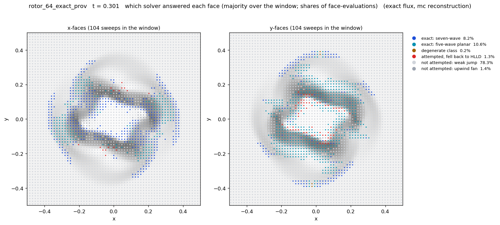

*Each face is coloured by its majority outcome over the 104 sweeps within
t = 0.30 +- 0.025, and the legend gives shares of face-evaluations.  The
x-faces are a mixture; the y-faces are almost all planar (teal); the HLLD
fallbacks (red) line the inner edge of the dense shell, bordering the central
cavity -- the crowded-wave-speed region of section 5, not the compound-wave
one.  A first version of the figure painted each face with the best outcome it
had in ANY sweep of the window, which made the seven-wave solver look twice as
common as the planar rescue; the counts above are the correction.*

## 4b. The gate: why 85.9% is never attempted

The gate is one line — `relative_jump(sL, sR) < tau_weak`, with
`tau_weak = 1e-2` in production — and everything below it takes HLLD.

`relative_jump` is not a naive measure. rho and p use ordinary relative
differences (strictly positive), velocity an absolute VECTOR jump (bounded by
1, already dimensionless), the field a vector jump against a pressure-floored
scale; vector norms rather than per-component maxima also make it
rotation-invariant. The reason is in its docstring: the obvious form has a
denominator that vanishes at a zero crossing, and since the rotor is a
ROTATING flow where vx, vy and By cross zero across most of the domain, that
form called **99.9%** of interfaces discontinuous at 1e-2 and the gate could
never fire.

**Why a gate is mandatory: cost.** The exact solve is ~30 ms per interface
against microseconds for HLLD. The run does ~8M interfaces per step over 284
steps; at 14.1% attempted it took 11.1 h, so ungated it would be roughly 7x
that before the failures burn their retry ladders.

**And it discards where the flux matters least** (dF = |F_exact - F_HLLD| /
|F_HLLD|, from harvested exact answers against HLLD on identical inputs):

| relative_jump | n | median dF | p90 dF |
|---|---|---|---|
| 0.01 - 0.03 | 1351 | 2.280e-04 | 3.946e-03 |
| 0.03 - 0.1 | 1370 | 5.328e-04 | 1.347e-02 |
| 0.1 - 0.3 | 560 | 0.000e+00 | 2.495e-02 |
| 0.3 - 1 | 719 | 6.622e-02 | 3.580e-01 |

Everything harvested is ABOVE the gate, so there is no direct measurement
below 1e-2; the trend supports extrapolating but that has not been measured.

### But keying on the jump ALONE is demonstrably not the best gate

Six candidate predictors of dF, Spearman rank correlation over 4000
interfaces. The jump is the best single one, but only just, and 0.41 is loose:

| predictor | rho_s |
|---|---|
| **relative_jump (the gate)** | **+0.414** |
| contact strength | +0.381 |
| \|B_n\| | +0.302 |
| \|Bt_L\|/\|B_n\| | -0.227 |
| sigma | +0.206 |
| slow-wave strength | +0.184 |

The gate ignores |B_n| entirely, though median dF rises from 1.8e-4 below
|B_n| = 0.1 to 8.7e-3 above 1. The concrete cost:

| | share |
|---|---|
| exact flux BITWISE identical to HLLD (dF < 1e-14) | **31.95%** |
| ray returns a pure upwind state (fan entirely on one side) | 38.10% |
| ... of those, identical flux | 83.86% |
| median dF over the non-upwind remainder | 4.055e-03 |

**Nearly a third of the interfaces we pay ~30 ms to solve return a flux HLLD
already produced.** They are supersonic: the whole fan sits on one side of the
ray, so the exact answer IS the upwind flux, which HLLD gets by construction.

**The fix, now implemented.** HLLD's signal speeds are clamped at zero, so
`cmin == 0` means every wave is right-going and its flux is f_L exactly;
`cmax == 0` gives f_R. `RMHD_UPWIND_SKIP` (default **on**) skips those, and
`n_upwind_skip` reports them.

Measured on 3,000 recorded interfaces sampled in the run's true
solved/failed proportion:

| | skip OFF | skip ON |
|---|---|---|
| attempted | 3000 | 1962 |
| upwind-skipped | 0 | 1038 (**34.6%**) |
| wall time | 91.41 s | 57.33 s |
| **speedup** | | **1.59x** |
| worst relative flux change | — | **7.6e-16** |

Regression: the full suite is 7 failed / 110 passed / 2 skipped, exactly the
known pre-existing baseline. `tests/test_upwind_skip.py` (5 tests) holds the
contract.

**A bookkeeping consequence to be aware of.** `n_exact` falls from 2273 to
1400, because a skipped interface receives the exact flux but is not *labelled*
exact. Reported coverage drops from 75.8% to 71.4% of attempted with no change
whatever in the physics. Whether skipped-upwind interfaces should be counted
as exact — they do receive the exact flux, to 1e-16 — is a reporting decision
that has not been made.

### What the gate discards, measured directly

The harvest cannot answer this (everything in it is above the gate), so:
shrink a real discontinuity by a factor s about the mean state, keeping both
endpoints physical, and solve with the gate opened to 1e-14.

| s | median jump | median dF | p90 dF | max dF | exact% |
|---|---|---|---|---|---|
| 1 | 4.57e-02 | 1.81e-04 | 1.23e-01 | 9.99e-01 | 95.5% |
| 0.3 | 1.37e-02 | 3.55e-05 | 1.31e-02 | 1.37e-01 | 94.1% |
| 0.1 | 4.57e-03 | 1.06e-05 | 2.16e-03 | 2.71e-02 | 95.4% |
| 0.03 | 1.37e-03 | 2.42e-06 | 4.57e-04 | 6.41e-03 | 96.8% |
| 0.01 | 4.57e-04 | 8.33e-07 | 1.54e-04 | 1.98e-03 | 97.0% |
| 0.003 | 1.37e-04 | 2.48e-07 | 4.56e-05 | 5.78e-04 | 97.0% |
| 0.001 | 4.57e-05 | 8.04e-08 | 1.43e-05 | 1.91e-04 | 96.8% |

dF scales as roughly `jump^1.1` — near-linear, no floor. At the production
threshold (jump = 1e-2) the interpolated median difference is ~2.5e-5 with a
p90 near 7e-3, and it falls away steadily below that.

**So the gate is justified.** The attempted population has median dF 3.7e-3
and moves the solution by 0.5%; the gated population's differences are ~100x
smaller while being ~6x more numerous, which scales to roughly **0.02%** —
negligible against a 32.8% resolution gap, for ~6x the compute. That is a
scaling argument from measured quantities, not a run comparison; measuring it
directly means a `tau_weak = 0` run, which has not been done.

## 4c. Below the weak-jump gate, measured (2026-10-01)

Section 4b argued from a scaling that the gate costs ~0.02% of the solution
for a sevenfold saving in compute, and said a direct measurement had not been
done. The recordings of the held-out windows hold every face of each sweep
(112,608 over 24 sweeps), so the gate can be replayed at any threshold
(`scripts/weak_gate_study.py`, calea job 33198, production settings):

| jump | faces | attempted at 1e-2 | solved when attempted | exact vs HLLD, p50 / p90 / max | wall |
|---|---|---|---|---|---|
| ≥ 1e-1 | 1,683 | 1,017 | 82.2% | 2.8e-3 / 7.6e-2 / 1.9e-1 | |
| 1e-2 .. 1e-1 | 17,385 | 15,765 | 94.7% | 3.7e-4 / 4.5e-3 / 3.7e-1 | |
| 1e-3 .. 1e-2 | 16,522 | 0 | 94.7% | 1.0e-4 / 8.4e-4 / 1.1e-2 | |
| 1e-4 .. 1e-3 | 6,322 | 0 | 96.7% | 1.2e-5 / 2.1e-4 / 3.6e-3 | |
| < 1e-4 | 70,696 | 0 | 77.9% | 1.2e-8 / 2.2e-7 / 6.0e-4 | |
| gate at 1e-2 | | 16,782 (14.9%) | 93.97% | | ~560 s |
| gate at 1e-3 | | 33,032 (29.3%) | 94.31% | | 883 s |
| gate at 0 | | 110,050 (97.7%) | 83.89% | | 1,156 s |

(the flux difference is `||F_exact - F_HLLD|| / ||F_HLLD||` over the eight
conserved components, on the faces that came out exact.)

Three things the scaling argument did not know:

* **The solver solves the weak faces**: 94.7% and 96.7% in the two decades
  below the gate, the same rate as above it. Below 1e-4 the rate drops to
  77.9% -- there the Newton's 1e-8 tolerance is no longer small against the
  problem, and HLLD is within 1e-8 of the exact flux anyway.
* **The flux difference falls linearly with the jump**, as 4b measured on
  shrunk problems: 1e-4 in the first decade below the gate, 1e-5 in the
  second, 1e-8 below that. The 4b extrapolation holds on real faces.
* **Opening the gate is cheaper than estimated**: the replay's wall time
  grows 1.6x at 1e-3 and 2.1x at 0, not 7x, because a weak face solves in a
  few iterations and the wall is set by the failing lanes' retry ladders.

### Does the gate miss a field that turns at equal energy? (2026-10-02)

The gate's field term is a VECTOR jump, |B_L − B_R| over |B_L| + |B_R| + √p,
so a turn at equal magnitude counts: 2|B| sin(Δψ/2) against 2|B| + 2√p. A
strong field passes the 1% threshold at a turn of 2°; a full reversal is
gated out only when the magnetic energy is below ~1e-4 of the gas pressure.
Measured on the held-out windows against the exact fluxes of the gate-at-0
replay (the induction flux = the flux of the two tangential field
components, compared relative to its own size, on faces where it is at
least 1e-3 of the total flux):

| tangential turn, below the gate | faces | HLLD induction flux vs exact, p50 / p90 / p99 |
|---|---|---|
| < 2° | 18,674 | 4e-5 / 2e-4 / 1e-3 |
| 2° .. 135° | 0 | (the rotor is coplanar: fields are parallel or antiparallel) |
| reversal, > 135° | 104 | 4e-5 / 2e-4 / **1.4** |

All 104 gated reversals have a tangential magnetic pressure below 1e-3 of
the gas pressure (97 below 1e-4). HLLD's induction flux is within 2e-4 of
the exact one on nine in ten of them and off by order one on about one in a
hundred -- one or two faces per 112,608, on a flux that is itself below
1e-3 of the total; the linearised solver does no better on those. Above the
gate, 119 reversals, HLLD's induction flux is off by 2e-4 (median) to 2e-2.
So the gate's blind spot for turns is real but confined to fields too weak
to carry energy, and cheap to close if wanted: attempting every face whose
tangential field turns by more than, say, 45° would add 104 faces per 24
sweeps.

### The linearised solver below the gate

`src/physics/linearised.py`: the jump decomposed into the characteristic
fields of the mean state (the flux Jacobian by central differences in the
primitive variables, one 7×7 eigenproblem per face), the state on the ray
built from the waves that run left, its physical flux returned -- the exact
solution to second order in the jump, where HLLD's error is first order. No
root-finding; a face whose eigenproblem cannot be trusted keeps HLLD. Never
counted as exact. `RMHD_WEAK_FLUX=linear` gives it the faces below the
gate; `--solver linear` runs it everywhere (the 1D driver and `run_2d.py`).

Against the saved exact fluxes of the replay above (calea job 33667):

| jump | faces | linearised vs exact, p50 / p90 | HLLD vs exact, p50 / p90 | ratio at p50 |
|---|---|---|---|---|
| 1e-2 .. 1e-1 | 14,934 | 1.0e-4 / 8.0e-4 | 3.7e-4 / 4.5e-3 | 3.7 |
| 1e-3 .. 1e-2 | 15,384 | 4.0e-6 / 2.7e-5 | 1.0e-4 / 8.4e-4 | 25 |
| 1e-4 .. 1e-3 | 6,115 | 1.0e-7 / 1.1e-6 | 1.2e-5 / 2.1e-4 | 120 |
| < 1e-4 | 55,051 | 1.0e-8 / 8.0e-8 | 1.2e-8 / 2.2e-7 | 1.2 |

The ratio grows by ~10 per decade of jump, as a second-order error against a
first-order one must, until both meet the exact solver's own tolerance below
1e-4. It answered 100% of the faces above 1e-4 and 99.5% below. On the
shrunk 1D problems of `tests/test_linearised.py` the same holds: its
distance from the exact flux falls 25 times or more over two levels of 1/3
where HLLD's falls three times.

### 1D tubes and the rotor with the linearised flux (2026-10-01)

Shock tubes, 200 cells, HLLD / linearised / exact against the analytic
profile (`shocktube_compare.py`, calea jobs 33662-33666), L1 of rho:

| tube | full strength: HLLD / linearised / exact | shrunk to 3%: HLLD / linearised / exact |
|---|---|---|
| Balsara 2 | 1.722e-1 / 1.722e-1 / 1.722e-1 | 1.476e-3 / 1.4745e-3 / 1.4743e-3 |
| Balsara 5 | 6.24e-2 / 6.05e-2 / 6.11e-2 | 1.7641e-2 / 1.7637e-2 / 1.7640e-2 |
| Mignone st1 (no reference converged; against the exact arm) | 7.4e-4 / 1.8e-3 / 0 | 3.3e-5 / 6.0e-7 / 0 |

At full strength the linearised solver is as accurate as the exact flux on
these tubes and never worse than HLLD -- a reassurance about stability, not a
claim: a strong shock is outside what it is for. Shrunk to 3%, all three
agree to 1e-4 of their own error on the Balsara tubes (the scheme's
truncation error dominates), and on st1 the linearised run sits 55x closer
to the exact run than HLLD does.

**The 64² rotor with `RMHD_WEAK_FLUX=linear`** (calea job 33659, 284
steps), against production (`results/rotor_64_exact_prov`, same code with
HLLD below the gate) and against the 512² reference:

| | L1 rho vs production at t = 0.4 | L1 rho vs the 512² reference | front radius | symmetry error, final |
|---|---|---|---|---|
| production | | 0.2874 | 0.4881 | 1.6e-2 |
| linearised below the gate | 2.9e-3 (core 8.7e-3) | 0.2880 | 0.4881 | 4.5e-3 |

Covering the 86% of faces below the gate with a second-order flux moves the
64² solution by 0.3% in L1(rho) and the gap to the reference by 0.2% of
itself -- in the direction of a larger gap, i.e. noise. (Production default
since 2026-10-01 nonetheless, by the user's decision: the exact solution's
accuracy everywhere, at second order, for a few percent of the cost.) The
per-face flux
differences of 1e-4 do not accumulate into anything the resolution gap can
see, which is what section 4b's scaling predicted (0.02% there, from a
cruder measure). The one visible change is the symmetry error, three
times smaller: HLLD's root-finder below the gate was breaking the
π-rotation symmetry more than the linearised solver does.

So, measured on the rotor: neither opening the gate nor replacing HLLD below
it changes the result at 64². The linearised solver is the right flux for
those faces if one wants the exact solution's accuracy everywhere -- at
second order, for a few percent of the run's cost -- but the rotor does not
need it. The decision whether to make it production is the user's.

## 5. How much does not

**19.9% of attempted interfaces get no exact flux** — about 2.8% of all
interfaces. What is known about them:

- **Not a seed problem.** A 7³ scan of the three-unknown box finds a feasible
  starting point for 100% of them; starting the Newton from the best such
  point converges on 8.5%. Feasibility is necessary and nowhere near
  sufficient. Retry ladders saturate abruptly — at ±2 and ±4 sqrt(2P) the gain
  is *exactly zero*, which is what a feasibility boundary looks like rather
  than a convergence basin.
- **Not the Alfvén/slow degeneracy.** This was proposed and **refuted**:
  failures are *farther* from coincidence than successes (median gap 7.9e-3
  against 3.3e-3 of the fast-wave span), and interfaces within 1e-3 of
  degeneracy succeed *more* often, 33.8% against 20.7%.
- **Field reversal is a real but narrow signal.** A tangential field that
  reverses raises the odds of failure by **3.67×**, monotonically with the
  normal field (2.36, 3.21, 3.05, 5.03, 8.13 across |Bn| bins). That is the
  Brio–Wu configuration, where coplanar compound waves are known to arise. But
  reversal covers only **2.8% of failures**.
- **The bulk sits at small normal field and large tangential field** —
  |Bt|/|Bn| median 1.41 failing against 0.76 succeeding — which is also where
  the solver is hardest for ordinary numerical reasons. The two explanations
  are confounded and the harvest cannot separate them.

### Brute force, run fairly (2026-09-09) — the strongest evidence we have

Asked directly: it must be possible to solve these, even by brute force. It
was a fair challenge, and the three previous searches were all unfair to the
method in specific ways:

- **a grid alone cannot approach a root.** Its nearest point is half a
  spacing away, so its best residual is ~||J||*delta whether or not a root
  exists. Measured: at 7³ the CONTROL group (roots known) plateaus at
  1.39e-1, essentially the same as the stubborn group's 1.62e-1. The residual
  is worthless as a discriminator; only Newton convergence from those points
  separates them (70% vs 0%).
- **a descent alone stalls**, because the residual is a CONSTANT sentinel
  wherever the structure will not construct, so a start outside the feasible
  set has zero gradient and never moves.
- **every search assumed the rotation is 0 or pi** — angle enumeration, the
  grids, the tube-frozen angles, the planar descent. But the rotor is coplanar
  only to chi ~ 1e-10 and 2.3% of measured rotations are intermediate, so a
  solution with an intermediate rotation was not representable by any of them.
  (Freeing the rotations turned out to matter for a different reason than
  this paragraph expected — see the correction of 2026-09-12 below.)

Doing all three properly — grid to locate the feasible set, 24 least-squares
descents from it, rotations FREE, objective = the full six-component residual
so anything found is exact by construction:

**The box has to be sized from data, not from physics intuition.** The first
run used +-2 in ln around ln(P_bar) for the pressures and ln(sqrt(2 P_bar))
for the contact field. Checked against the CONTROL group's known answers,
that box misses **35.6%** of them: the pressures never stray beyond 0.93 of a
half-width, but ln|Bt_CD| needs 7.5 for p99 and 11.9 for all, and its true
centre sits e^1.26 ~ 3.5x above sqrt(2 P_bar). Re-run with half-widths 1.5
(pressures, 11 pts) and 9.0 (field, 61 pts), equal spacing 0.30 everywhere:

| | feasible grid pts | best full \|\|f\|\| (median) | zero residual (1e-8) | rotations found |
|---|---|---|---|---|
| **CONTROL** (root known) | 5854 | **3.38e-14** | 90.0% | 0: 92%, pi: 3%, intermediate: 6% |
| **STUBBORN** | 5243 | **1.52e-02** | 5.0% | 0: 50%, intermediate: 50% |

(the undersized box gave 82.5% / 5.0% — it handicapped the control group by
7.5 points.)

**These two rates are UNGATED and the rotation column is wrong — see the
2026-09-12 correction below before citing either.** What survives: the
instrument drives known roots to machine precision (3.4e-14) while the
stubborn set stalls twelve orders of magnitude higher, and three confounds
are closed:

- **not feasibility** — the two groups have comparable feasible sets;
- **not resolution** — the descent proved it has no floor by hitting 1e-14;
- **not the box** — it is now sized so the known answers fit inside it.

### A zero residual is not a solution (2026-09-12) — the rotation result retracted

This script never applied the wave-order gate that `exact_flux.py`
(`RMHD_WAVE_ORDER`) and `rescue_collect.py` do, and it stopped at the first
zero residual. Re-gating the four completed 1280+1280 runs of 2026-09-10/11
(30 descents, `HLLD/results/brute_*`) with the same rule — a rotational
discontinuity that crosses its slow wave while carrying a jump, or any other
inversion, is a self-crossing fan, not a solution:

| box | CONTROL raw → admissible | STUBBORN raw → admissible |
|---|---|---|
| global, field [-16, +2] | 88.36% → **76.25%** | 7.66% → **4.06%** |
| HLLD-centred | 89.30% → **78.91%** | 8.98% → **3.91%** |
| rebalanced 5/300/5 | 81.56% → 71.56% | 7.73% → 4.06% |
| rebalanced, HLLD-centred | 85.94% → 76.41% | 7.58% → 3.75% |
| **union of the four** | 92.34% → **83.75%** | 10.16% → **5.08%** (65/1280) |

Three consequences.

1. **The stubborn rate was inflated 2x.** 47–57% of the stubborn "roots" were
   fans. Gated, the four boxes tie (paired McNemar p = 0.81, 1.0, 0.81) at
   3.75–4.06%, and the union is 5.08% — the ceiling every earlier search hit.
   The apparent win of the HLLD-centred box (p = 0.006 ungated) was fans.
2. **"Half need an intermediate rotation" is retracted.** Of the
   intermediate-rotation "solutions", **83–93% were fans**. The survivors live
   at |Bt_CD| ~ 1e-2–1e-3, 100–350x weaker than the 0/pi solutions, where the
   residual is ~4,000x less sensitive to the angle (perturbing phi_L by 0.1
   rad moves it to 3.7e-5 against 1.1e-1 on a strong-field row). An
   intermediate angle there is what a weakly determined unknown looks like,
   not evidence for a non-coplanar solution family. Among ADMISSIBLE
   solutions the split is 2.6–2.9% intermediate on controls and 4–12% on
   stubborn (2–6 interfaces of ~50), and the admissible stubborn roots have
   ordinary field strength (median ln|Bt_CD| −0.42 / +0.02 against +0.04 for
   controls) — the weak-field ones were the fans. The singular-limit
   hypothesis loses this support; it keeps the 3.67x reversal odds ratio and
   nothing else from this section.
3. **The jump conditions have more than one root, and admissibility selects.**
   On 11–12% of CONTROL interfaces — where an admissible root is known and the
   harvest itself is only 1.9% inadmissible — the descent converged to a
   different, inadmissible root and then stopped. This does not contradict
   §5b (which compared admissible answers with each other), but it sharpens
   it: uniqueness is a statement about admissible solutions, and any search
   that stops at a zero residual can be stopped by the wrong root.

The gate is now inside the descent loop (`_admissible`); a fan is skipped and
the remaining descents continue, and `*_best_raw` keeps the ungated number
for the record.

**A grid refinement study agrees.** Best residual over 7³ → 13³ → 25³
(2744 → 125,000 points): the control halves cleanly (1.92x, 1.93x) as
||f|| ~ ||J||*delta requires; the stubborn group's rate decays (1.85x, 1.58x).
Fitting ||f|| = c + k*delta gives a floor c ~ 0.0024 for the control
(consistent with zero) and **c ~ 0.023 for the stubborn set**, ten times
larger. Extrapolation from three points, so a signal rather than a proof —
but the control behaved exactly as it should, which none of the earlier
attempts managed.

**Verdict.** Brute force works, and it says most of these interfaces have no
admissible elementary-wave solution. This is still not a proof — a descent
can stall in a local minimum of ||f||², it demonstrably stops at inadmissible
roots, and 5% did turn out to be solvable — but it is the first argument here
whose instrument was validated on a control group before its conclusion was
drawn, and the 2026-09-12 gating is the second time that control group caught
the instrument lying.

### Can we prove they are unsolvable? No — three attempts

1. **Per-component sign certificate.** A root needs all three residual
   components zero at one point, so one component keeping a single sign over
   the whole feasible set proves no root. Sound in principle; at 48³ over the
   physically bounded box it produced **2/6 false certificates**, because only
   ~6% of that box is constructible and sign changes were missed. Re-run
   adaptively with 20k–30k feasible points: **0/15 stubborn and 0/15 control**.
   Withdrawn.
2. **Counting unconstructible branches as "no root".** Unsound. A branch that
   will not construct is a Newton failure inside `alfven_checked`, not a
   non-existence result.
3. **Combinatorial degree** (cells whose eight corners realise all eight sign
   patterns). **Fails its own validation gate: 0/12 controls**, which provably
   have roots. At 56³ a cell is ~0.5 wide in Bt while a root must be localised
   to ~1e-6.

**The general lesson: grid methods cannot settle this.** It is 3D root
localisation where the root, if it exists, occupies a vanishing fraction of
the box. What could still work: *homotopy continuation* (track the root from a
solvable neighbour; a fold would be evidence of non-existence with a
mechanism), and the high-resolution *tube test*, which would exhibit what the
solution **is** rather than proving what it is not.

### Homotopy continuation, run (2026-09-20) — a rescue, and no fold

`scripts/coplanar_limit.py` does what the paragraph above asks for. Every
interface is coplanar to ~1e-11, so it is tilted out of its plane: in the
planar frame the left tangential field is rotated by +eps and the right by
-eps at fixed |B_t|, rho, gas pressure and velocity, which makes an ordinary
FULL7 problem of it. The solution is then followed down a ladder
eps = 1e-1 ... 1e-6, each rung warm-started from the one above and a failed
rung re-walked in 2, 4 then 8 sub-steps, and finally polished at eps = 0.
An answer counts only if it passes what production requires: full seven-wave
residual <= 1e-8 **and** the waves in order.

**The population had to be re-measured first.** The lanes come from a 64^2
harvest that predates the Alfven sign fix (rmhd_final d09ffe2), so each one
was first re-run through today's production path: **276 of the 1280
"stubborn" interfaces (21.6%) are simply solved now** — 78 by the seven-wave
Newton, 230 by the planar solver. Every stubborn number measured before
2026-09-20, including the brute-force ceiling above, carries that
contamination.

**Validation gate**, on the 1219 control lanes the planar solver verifies:
the difference to the planar answer falls linearly in eps (median 2.68e-2 at
1e-1 to 2.68e-7 at 1e-6), the eps = 0 polish verifies on 94.8% of them and
agrees with the planar answer to a median 4.7e-11. The rate at which a
control is dragged onto a different branch and ends up labelled "singular" is
0.25%, which is the noise floor for the stubborn classification below.

**The 1004 genuinely stubborn lanes** (calea job 631, 2560 lanes, 2 min):

| class | share | what it means |
|---|---|---|
| NOSTART | 83.2% | not solvable even tilted, at any eps from 0.03 to 1 rad |
| LOST | 12.7% | the branch is lost below some eps*, with **kappa(J6) unchanged (ratio 1.00 on every lane)** |
| SINGULAR | 0.3% | = the control artifact rate; no signal |
| EXACT0 | **5.1%** | 51 verified exact answers, 50 with rotations at {0, pi} |

Two conclusions, both negative for the original hope and one useful:

* **No fold.** A fold would show as the Jacobian's condition number diverging
  as eps -> eps*; it does not move at all. The lost lanes are Newton
  failures, not a branch ending. So continuation does **not** supply the
  non-existence argument.
* **Coplanarity is not the obstacle.** kappa stays ~12-21 down to eps = 1e-6,
  so the angle unknowns are observable at finite |B_t| (only |B_t| -> 0 loses
  them), and tilting a stubborn interface by up to 1 rad leaves 67-78% of
  them unsolvable. Whatever makes them hard survives leaving the plane.
* **But it rescues 5.1%** that production misses, concentrated at
  |B_n| in [0.01, 0.1) (34% of that bin). Brute force finds 23 further lanes;
  together 74 of 1004 (7.4%), consistent with the ~5% admissible ceiling
  measured above.

The open question is therefore the 83% that cannot be started at all, which
is a basin question rather than a geometry one, and the tube test below.

### The tube test, run (2026-09-20) — the structure is not in the family

`scripts/tube_features.py` answers the question the Newton cannot: it evolves
each interface as a 1D shock tube (`src/physics/tube_seed.run_tubes`), which
solves the PDE and therefore shows the real structure whatever the solver can
represent. Two resolutions are run so a feature counts only when it appears
in both; speeds are read in the similarity variable xi = x / t; each feature
is assigned to a wave family by comparing its speed with the seven
characteristic speeds on either side of it. 351 interfaces (calea job 673),
100 per group drawn from item B's classes.

**Counting features answers nothing**, and the reason is worth recording. The
detector resolves waves of strength >~1e-2 -- it finds 2.91 confirmed features
per lane against 2.89 waves above 1e-2 in the known answers, and 4.47 above
1e-3 -- but the seven characteristic speeds are routinely crowded inside 0.02,
so neighbouring waves merge into one feature and a per-wave assignment is only
21-40% reliable. Doubling the resolution (1024 + 2048) changes nothing:
features per lane 2.87 -> 3.03 on controls, and the single "two features in
one family" seen at the coarser pair disappears. **No lane in any group shows
two features in one family.** The spec's compound-wave test comes back empty.

**Asking what each feature IS answers it.** The elementary family allows only
two kinds of jump: a rotational discontinuity turns the tangential field and
leaves rho, P_tot and |B_t| alone, and a magnetosonic wave changes them
without turning the field. So test every feature against that:

| group | reversal + magnitude jump | \|B_t\| -> 0 inside a feature | rotation only |
|---|---|---|---|
| control (the solver answers these) | **2.0%** | 10.0% | 0.0% |
| stubborn, ladder never starts | **61.0%** | 83.0% | 5.0% |
| stubborn, ladder lost | **78.0%** | 86.0% | 2.0% |
| stubborn, rescued at eps = 0 | 23.5% | 39.2% | 0.0% |

The stubborn interfaces carry a **field reversal through |B_t| = 0 fused to a
density and magnitude jump** -- a compound or intermediate wave. The seven-wave
system has no root for it by construction: neither of its two jump types can
do this. The 2% on controls is the test's own false-positive rate, and the
lanes item B rescued sit in between at 23.5%, which is what they should do,
being the ones that DO have an elementary root.

Two supporting numbers point the same way. The seven-wave residual evaluated
at the structure read straight off the profile is 2.5e-2 on controls against
1.7e-1 and 2.4e-1 on the two stubborn groups; and handing that read to the
Newton finishes 79-82% of controls against **2%** of the never-starting
stubborn lanes.

**So the answer to section 5's question is: the solver fails on these
interfaces because their solution is not in the family it searches.** Not a
seed, not conditioning, not coplanarity -- all three were tested and cleared
above. Figures for individual lanes (`scripts/plot_tube_profiles.py`, written
to the git-ignored `figs/tubes/`; the committed one is below) show it directly: lane 1187 reverses the
field twice while |B_t| dips to zero, lane 1519 does it inside a single slow
wave, and v_z stays at 1e-14 throughout, so these are planar problems.

Caveats, so the claim is not overread: the detector is blind below ~1e-2 in
strength, the groups are 100 lanes each (so a percentage carries about +-5),
and a compound wave is identified by what its jump violates, not by resolving
its internal structure.

**Over the whole population, not a sample** (calea job 721, every one of the
1004 still-stubborn lanes plus 300 controls, at 256 + 512 cells): the reversal
fused to a jump appears on **58.8%** of the lanes the ladder cannot start and
**68.0%** of those it loses, against **4.3%** of controls. The control rate is
higher than the 2.0% measured at 512 + 1024 cells, as a coarser screen should
be; the stubborn rates agree with the 100-lane sample within its +-5.

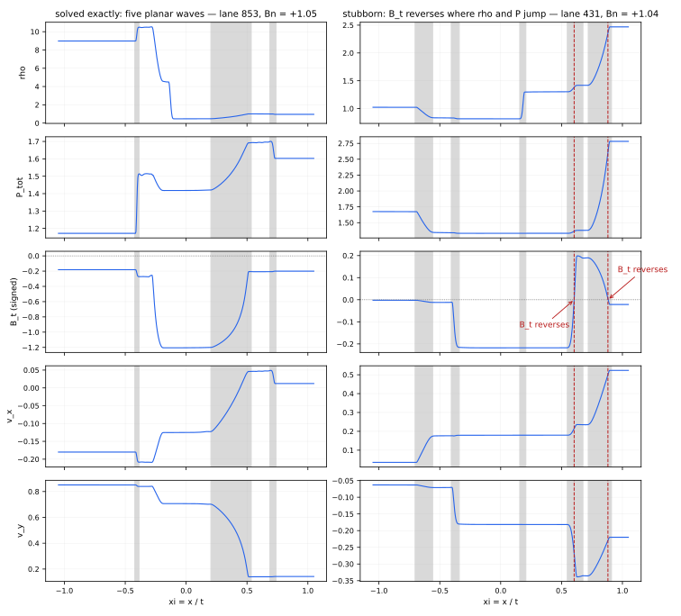

*Left: lane 853, an interface the solver answers exactly -- five planar
waves, the two rotations silent, and B_t never changes sign. Right: lane 431,
a stubborn interface at almost the same normal field (B_n = +1.04 against
+1.05). At xi ~ 0.6 the tangential field flips from -0.22 to +0.20 exactly
where rho, P_tot, v_x and v_y all jump (red dashed line), and it crosses zero
again inside the right-going fast rarefaction. Grey bands are the detected
features. Lane 431 was chosen as the clearest of the whole screen (job 724
re-ran the eight best candidates and a matched control each at 512 + 1024
cells); the title says only what is visible, because at this resolution a
fused wave and a pi-rotation riding exactly on the slow wave look the same.
Either way no admissible elementary root exists: brute force, which
enumerates every rotation including pi, found none. PDF for the paper:
`figs/compound_wave_pair.pdf`.*

### Where the stubborn population stands (2026-09-21)

Of the 1280 interfaces that were stubborn in the pre-fix 64^2 harvest:

| | lanes | share |
|---|---|---|
| solved by today's production path (seven-wave 78, planar 230, both 32) | 276 | 21.6% |
| + an exact answer from the eps-ladder (item B) | 51 | |
| + from brute force, B_n >= 0 only | 21 | |
| + from the tube read handed to the Newton (item C) | 12 | |
| **exact today, by any method** (the three rescues overlap; union 68) | **344** | **26.9%** |
| left without an exact answer | 936 | 73.1% |

Brute force found 13 further roots on B_n < 0 lanes, but it ran with the
sign-swapped Alfven speeds, so those roots are not verified under the fixed
solver and are not counted. Of the 936 left, 933 were screened by the tube
test and **60.0%** carry the reversal fused to a jump -- the structure the
seven-wave family cannot hold. The eps-ladder, brute force and the tube seed
are measurement tools; none runs in production, and turning any of them into
a production rescue would need its own paired rotor replay.

### Where compound waves appear, and what predicts them (2026-09-22)

The screens above worked on harvest rows, which carry no grid position. To
put compound waves on the rotor, the census rebuilds every interface from
the snapshots instead (`scripts/snapshot_census.py`, calea job 829). It
covers the 9 snapshots of the 64^2 run. At each, it reconstructs the face
states with the run's own MC limiter, applies production's gates (bad state,
weak jump, upwind), solves what remains with today's code (after the Alfven
sign fix), and tube-tests every lane at 256 + 512 cells. That gives 10,172
attempted interfaces, each with a position, a time and two labels.

**Base rates.**

| | share |
|---|---|
| unsolvable today (neither the seven-wave nor the planar solver) | 6.6% |
| compound (the tube sees a reversal fused to a jump) | 2.5% |
| P(compound given unsolvable) | 29.0% |
| P(unsolvable given compound) | 75.7% |

Leaving out t = 0, the rotor's initial edge, changes these by at most 2
points. So compound interfaces are mostly unsolvable, but they are only about
a third of what is unsolvable. The rest is the older difficulty, crowded wave
speeds; see below.

**What predicts compound: a weak tangential field that reverses.** The
features are all computable from (L, R, B_n) before any solve
(`scripts/compound_classifier.py`). Cross-validated by snapshot time, an L1
logistic regression separates compound from elementary interfaces with AUC
0.991 +- 0.002. A single feature, |B_t| on the weaker side, already reaches
0.95. On compound lanes its median is 0.009; on elementary lanes it is 0.56.

Small B_t alone does not make the label, which rules out the obvious worry.
A reversal through |B_t| = 0 is nearly automatic if one side already has
B_t ~ 0, so the label could have been circular. The data say it is not:

| min\|B_t\| / \|B_n\| below | lanes | compound | unsolvable | share of all compound |
|---|---|---|---|---|
| 0.01 | 402 | 28.6% | 31.1% | 44.4% |
| 0.03 | 717 | 22.2% | 25.2% | 61.4% |
| 0.10 | 1353 | 16.0% | 20.3% | 83.8% |
| 0.30 | 2723 | 9.3% | 17.4% | 98.1% |

Within the 1353 lanes below 0.1, the label still discriminates. Compound
lanes there are 81.6% unsolvable; the others only 8.5%. What separates them
is the angle between the two tangential fields (AUC 0.85): compound lanes
rotate by more than pi/2. That gives a two-condition rule:

> **min|B_t| < 0.3 |B_n|  and  |Δψ| > π/2**
> (the field is nearly normal to the face, and its tangential part reverses)

It flags 252 lanes (2.5%). Of those, 81% are compound, and it finds 79% of
all compound lanes. 76% of the lanes it flags are unsolvable, against 4.9%
outside it. This is the regime where the slow, Alfven and fast speeds
approach one another: near B_t = 0 the MHD system loses strict
hyperbolicity, and that is where intermediate and compound waves live.

**Where they sit.** The regime has a geometric reading on the rotor.

- On x-faces, compound lanes lie on the outer fast front near the x-axis,
  where the field is still along x.
- On y-faces, they line the edges of the wound-up central band, where the
  tangential component B_x changes sign.

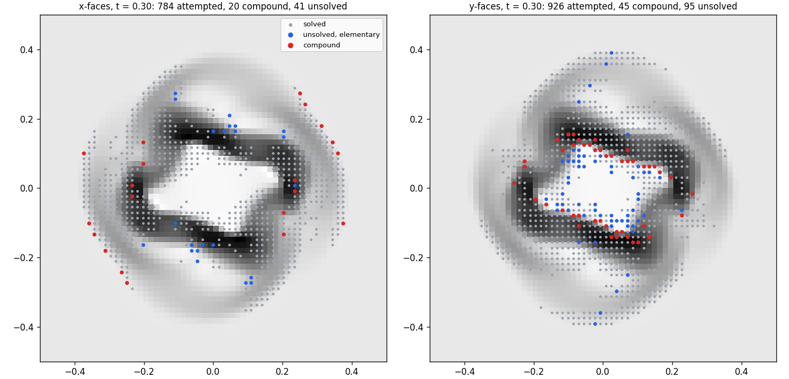

*The 64^2 rotor at t = 0.30, over log density. x-faces left, y-faces right.
Red: compound; blue: unsolved but elementary; grey: solved. The other eight
times are in `figs/census/` (not tracked); run the command in "Reproducing
the numbers" to redraw them.*

**The other two thirds: crowded speeds, not compound waves.** For the target
"unsolvable", the time-cross-validated AUC is 0.957. The strongest
coefficients are a small gap between the contact and the waves beside it
(`d_contact`), a narrow fast fan (`d_fast`) and high magnetisation. The
unsolved elementary lanes collect in the low-density central cavity, mostly
on y-faces. This is the pressure-cancellation and speed-crowding difficulty
of high sigma, not a missing wave.

**The failure map agrees.** `scripts/failure_map_2d.py` puts the pre-fix
harvest's own failures (attempted but not exact) back on the grid. It sees
the same x/y asymmetry: y-sweeps fail 67-79% of their attempts, x-sweeps
25-41%. On y-faces the B_n < 0 share of failures equals the attempted base
rate, so the Alfven sign bug does not drive that asymmetry. With a 5% field
floor, failures lean only mildly towards reversals of the cell field:
enrichment is below 1 on x-faces and 1.1-1.4 on late y-faces. That fits the
census, where a reversal alone predicts little and the reversal matters only
together with a nearly normal field.

### The same at twice the resolution (2026-09-22)

Two things could have made the census above an artifact: the tube test's own
resolution, and the grid's. Both were checked, and neither is.

**The tube labels are resolution-stable.** 5% of the 64^2 lanes (512 of
them, a systematic subsample; calea job 1236) were re-tube-tested at 512 +
1024 cells instead of 256 + 512. The labels agree on **98.4%**, and on
**99.8%** once t = 0 is left out -- 7 of the 8 disagreements are on the
rotor's initial edge, and the single one elsewhere is a lane the finer tube
calls compound and the coarser one does not. Solvability came out identical,
as it must, since it does not involve the tube. The plan's threshold was 95%,
so the 256 + 512 labels stand.

**The 128^2 census reproduces the 64^2 one** (calea job 1237, 9 h 15 min,
16,930 attempted interfaces).

| | 64^2 | 128^2 |
|---|---|---|
| attempted interfaces | 10,172 | 16,930 |
| unsolvable | 6.6% | 6.4% |
| compound | 2.5% | 2.3% |
| P(compound given unsolvable) | 29.0% | 24.6% |
| P(unsolvable given compound) | 75.7% | 68.1% |
| the rule flags | 2.48% | 2.18% |
| ... of which compound (precision) | 81.3% | 81.8% |
| ... of all compound found (recall) | 79.2% | 77.0% |
| ... of which unsolvable | 76.2% | 66.9% |

The compound fraction is the same at both resolutions, so it is not a
discretisation artifact, and the rule carries over untouched -- it was fitted
on 64^2 and applied to 128^2 with the same two thresholds.

**The classifier transfers both ways.** Trained on one resolution and tested
on the other, with no refitting:

| target | 64^2 -> 128^2 | 128^2 -> 64^2 |
|---|---|---|
| compound | AUC 0.994 | 0.988 |
| unsolvable | 0.963 | 0.963 |

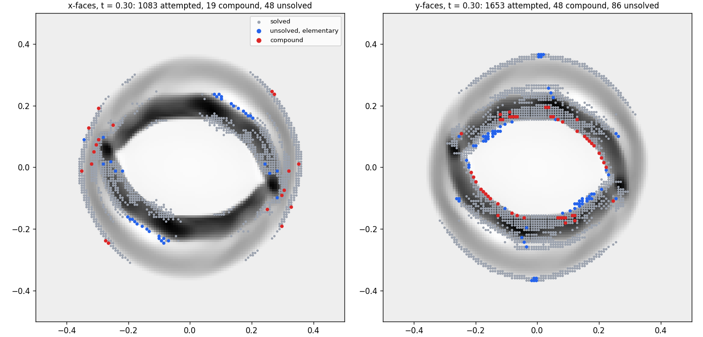

*The same time as the figure above, at 128^2. The compound interfaces are no
longer scattered points: they line up into curves along the wound-up shell,
which is what a codimension-one locus -- the set where the tangential field
vanishes -- should look like once it is resolved.*

**What this means for ML.** The seed network cannot learn these lanes as
they stand. Its output is the seven-wave unknowns, which cannot express a
compound wave, and the label would be ambiguous: Balsara 1 has two exact
solutions. A classifier needs no network, though. The rule above uses two
numbers that are cheap before any solve, and it could route the 2.5% it
flags past the full retry budget -- that was plan F step 4, and it was
measured; see below.

### Routing them past the solver: measured, and NOT worth it (2026-09-24)

`RMHD_COMPOUND_SKIP` (`src/physics/exact_flux.py`, default OFF) applies the
rule before the ML seed: a flagged interface keeps HLLD's flux and costs
nothing. The routed interfaces stay visible -- `harvest.record_coverage`
writes a third bitmap, `routed`, beside attempted and exact.

Paired replay, the same 12 recorded sweeps of the 32^2 rotor through both
settings (calea job 1780):

| | flag off | flag on |
|---|---|---|
| exact fluxes | 362 | 340 |
| interfaces routed | — | 60 |
| of those, exact with the flag off | — | **22** |
| wall | 119.8 s | 110.2 s (8.0% less) |

**6.1% of the exact fluxes for 8% of the time, and the flux moves a lot on
what it gives up**: on the routed interfaces that had been exact, B_y
changes by 62% on sweep 1 and 1.8% on sweep 3. The step's own gate was time
saved with no meaningful loss of exact fluxes, so it fails, and the flag
stays off.

Two reasons it underperforms the census. The census labelled "solvable" with
`coplanar_limit.production_retest`; production's real retry ladder does
better, so 37% of what the rule flags IS solved in the run, against the 24%
the census predicted. And the losses concentrate where |B_t| is exactly zero
on both sides -- the t = 0 x-sweep -- which the rule flags wholesale and
which the degenerate three-wave path already answers. That sweep is also
where most of the saving comes from (21.5 s -> 1.2 s), so the saving and the
damage have one source. A rule that additionally demanded a genuinely
nonzero tangential field on both sides would be the thing to try; it is not
tried here.

The wall numbers are noisy at this size -- sweep 2 went 1.1 s -> 19.0 s on
first-call compilation alone -- so 8% is the optimistic reading.

### Which of the two solutions does a finite-volume run pick? (2026-09-24)

Balsara 1 carries the non-uniqueness in its cleanest form: a compound wave
and a single intermediate shock, both exact, 7.7e-4 apart in the star state.
Which one a scheme converges to is a property of ITS dissipation, not of the
ideal equations -- the selected weak solution depends on the ratio of the
effective viscosity to the resistivity, and refining shrinks both while
holding the ratio, so the limit does not move. Two knobs were tested, each
at 1024, 2048 and 4096 cells, as the relative distance from the tube's star
plateau to each exact answer (`scripts/compound_wave.py --balsara1 --flux
{hlld,hlle} --limiter ...`; calea jobs 1422 and 1671):

| flux, reconstruction | -> compound | -> intermediate shock |
|---|---|---|
| HLLD, PLM | 1.0e-3 / 9.9e-4 / 1.6e-3 | 1.1e-3 / 3.8e-4 / 5.2e-4 |
| HLLD, MP5 | 1.4e-3 / 1.0e-3 / 1.4e-3 | 6.1e-4 / 3.2e-4 / **2.7e-4** |
| HLLE, PLM | 1.0e-3 / 4.7e-4 / 1.1e-3 | 2.1e-3 / 6.2e-4 / **9.1e-5** |
| HLLE, MP5 | 5.1e-4 / 8.8e-4 / 1.2e-3 | 5.8e-4 / 2.1e-4 / **1.3e-4** |

(MP7 and WENO5-Z were run too, at 512-2048, and behave like MP5.)

**Neither knob moves the selection.** Every combination approaches the
intermediate shock, reaching 9.1e-5 at 4096 -- eight times inside the
separation between the two answers -- while the distance to the compound
answer stalls near 1e-3 at every resolution. Raising the reconstruction from
second to seventh order only gets there on fewer cells; the more dissipative
flux (HLLE) converges most cleanly, which is the opposite of what "less
dissipation reaches the compound branch" would predict. That is expected:
order controls the error where the solution is SMOOTH, while the selection
happens inside the discontinuity, where every scheme is first order and the
profile is the flux function's own.

The consequence is worth stating plainly, because it is easy to report a
number and call it the answer: within ideal MHD the compound/intermediate
question is not decided by the equations. It is decided by the dissipation,
and a code that reports one of the two is reporting a property of its own
solver. Choosing deliberately means adding physical resistivity and
viscosity with a stated ratio and resolving those scales -- which is no
longer ideal MHD.

---

## 5a. Toward 100%: the failure ledger (2026-09-29)

The goal changed from explaining the failures to removing them. Before
building anything, every interface production loses was offered -- offline,
with a generous budget -- to every method this project has, and every answer
was held to production's own acceptance (full residual to 1e-8, ray,
physical state, wave order). 36 recorded sweeps of the 64² rotor (windows at
t = 0.10, 0.25, 0.40, two steps each, fixed in advance); production replays
its own recording bitwise (G0).

| | interfaces | of the failures | of attempted |
|---|---|---|---|
| attempted | 24,429 | | |
| exact in production | 23,058 | | 94.39% |
| failing | 1,371 | | 5.61% |
| **R1** recovered by a cheap method (more seven-wave retries, planar flips × seeds) | 198 | 14.4% | 0.81% |
| **R2** recovered only by an expensive search (ε-ladder, tube-read seed) | 101 | 7.4% | 0.41% |
| **R3** recovered only by the intermediate branch (slow-shock window opened) | 56 | 4.1% | 0.23% |
| **R4** nothing found | 1,016 | 74.1% | 4.16% |

If every recovery were a rung of the ladder the solved fraction would be
95.61% (95.84% with the intermediate branch). **The ceiling of what we have
is 96%, not 99%**, and three quarters of the failures are beyond every
method. What follows is about those.

Per method: seven-wave with 8 retries and diverse seeds recovers 11 (the
seven-wave solver is not seed-limited here); the planar solver over 4 flip
branches × 6 seeds recovers 192, **none of them from the start production
uses**; the expensive searches 250; the intermediate branch 203. Of the 192,
three starts on the unflipped branch (Bt_CD = +|Bt_L|, +|Bt_R|, -|Bt_L|)
account for 163 and two flipped ones for 22 more. On 1,188 controls the
planar sweep answers 1,183 and never with a different star pressure; the
intermediate branch differs on 2 (0.2%) -- it can find another root.

Two readings the cards settled:

* **"Converged but fails the full residual"** (184 lanes in production) is
  not a tolerance problem: the three planar equations close to 1e-12 and the
  full system is off by O(1), all of it in the slow-wave slack -- the slow
  wave cannot reach the tangential field it was asked for. 153 of them are
  R4.
* **The 16 self-crossing refusals** are all solved by the planar solver from
  its default start; production does not offer them to it
  (`RMHD_PLANAR5_CROSSED`, below).

### What R4 is: mostly NOT compound waves

The tube test calls 321 of the 1,016 compound (31.6%; 27.9% of all
failures). **The other 695 -- 2.85% of attempted, half of everything
production loses -- are elementary according to the PDE**: only magnetosonic
jumps, no reversal, and jumps between the two states as small as on the
interfaces production solves (median largest relative jump 3.5% against
4.3%). For such a problem a solution of elementary waves exists. We do not
find it.

What distinguishes them is the field geometry: |B_n|/|B_t| has median 4.4
against 0.85 on the controls -- the field is nearly NORMAL to the face, and
where in addition the Alfven speed exceeds the sound speed the fast and the
Alfven eigenvalue nearly coincide.

`scripts/ledger_subwaves.py` evaluates the four waves the planar solver has
to construct, at its default start:

| group | n | a fast wave fails | a slow wave fails | any |
|---|---|---|---|---|
| controls (solved) | 1,188 | 0 | 10 | 1% |
| R1 | 198 | 0 | 56 | 26% |
| R2 | 101 | 4 | 42 | 46% |
| R4, compound | 321 | 9 | 2 | 3% |
| R4, elementary | 695 | 120 | 138 | 36% |

Every one of the 120 failing fast waves is a weak SHOCK (dp/p median 0.4%).

### A defect, found and repaired: the fast-shock scan steps over a pair of roots

The fast-shock solver scans the Hugoniot residual on 500 uniform nodes
between the light cone and the Alfven speed (plus 200 stretched towards the
light cone) and bisects sign changes. On these 120 waves
(`ledger_subwaves.py --pairs`, 30,000 nodes each):

* the residual has **exactly two roots on every one of them**, never closer
  than 1.01 fast-Alfven gaps and typically 1.9 apart, the outer one between
  0.03 and 10⁴ gaps from the fast eigenvalue;
* the gap is 0 to 0.8 of one scan step. The scan sees the same sign on both
  sides of the pair and reports that there is no shock;
* on 119 of 120 exactly one of the two is an evolutionary fast shock:
  two-sided Lax on the fast family AND super-Alfvenic behind. The other root
  leaves the flow behind it sub-Alfvenic -- an intermediate shock. Lax on the
  fast family alone, which is what the solver checks, admits both.
* the tangential field in the solver's frame is NOT a criterion: with a
  tangential velocity it weakens across a genuine fast shock (to 0.956 of
  its value on one of the test lanes).

No scan is fine enough for a pair 10⁻⁷ apart, so `fast_edge_scan`
(`rmhd/batched/shock_b.py`, `RMHD_FAST_EDGE_SCAN=1`, default off) SPLITS the
pair instead: at the zero of `Vs - (Alfven speed behind)`, which has a simple
zero and an O(1) range, and at the fast eigenvalue of the ahead state; from
the split point outward the first sign change is the fast shock. It runs only
on lanes the standard scan gave up on, so no existing answer can move. It
finds 112 of the 120.

Measured, paired against the 36 recorded sweeps: **exact 23,058 → 23,084
(94.39% → 94.49%), gained 26, lost 0** (McNemar p = 3e-8); of the 23,058
exact in both, one star pressure moved, by 7e-10.

### Why the gain is small: the residual is not a function yet

`scripts/newton_trace.py` prints one planar Newton iteration by iteration.
On the unsolved elementary interfaces the iteration does not fail to
converge in the usual sense -- the RESIDUAL JUMPS. Interface 719 (states
equal to 1e-4 in total pressure, σ ≈ 1, |B_t|/|B_n| = 0.12):

| iteration | right slow shock speed | right fast wave speed | |f| |
|---|---|---|---|
| 0 | +0.434 | +0.446256 | 1.0 |
| 1 | +0.220 | +0.446256 | 7.8e-3 |
| 2 | +0.446248 | +0.446256 | 3.9e-3 |
| 3 | +0.492949 | +0.492837 | 3.3e-3 |

The slow shock's speed hops between branches from one iterate to the next
(0.220 is the slow wave; 0.446 sits on the Alfven speed), in the last row it
is FASTER than the fast shock, and between iterations 2 and 3 the right
fast-wave pressure moved by 28% while the residual barely changed (smallest
singular value of the Jacobian 2e-7). A Newton iteration on a function that
changes branch under it cannot converge, whatever its seed -- which is also
why neither more seeds nor the tube-read seed (accurate to 1e-3) helped.

`newton_trace.py` over 200 of these interfaces: the line search finds no
smaller residual on 109, a wave cannot be constructed at the very start on
71, 4 converge (with the edge scan: 131, 40 and 10).

### The cause: the tangential field is the wrong coordinate for these slow waves

The solver describes each slow wave by the tangential field it must reach
(`Bt_CD`), and chooses shock or rarefaction by whether |B_t| has to fall or
rise -- across a slow shock the field weakens. Both are properties of one
regime. Followed along the slow family from the state behind the fast wave
(`P` the total pressure):

| interface, side | slow shock, P × 1.01 | slow shock, P × 1.10 | the solver's target |
|---|---|---|---|
| 1394 left | B_t × 0.920 | × −0.413 | +1.90% |
| 1394 right | **B_t × 1.0014** | **× 1.056** | −0.77% |
| 719 left | B_t × 0.926 | × 0.030 | −1.39% |
| 719 right | B_t × 0.9937 | × 0.948 | −2.22% |
| 1816 right | B_t × 0.9903 | × 0.897 | −13.8% |

* On 1394 right the slow shock STRENGTHENS the field (the states are in the
  solver's frame, with a tangential velocity of 0.52). The target asks for a
  weaker field, the solver therefore builds a shock, and no slow shock
  reaches it: the only root of its equations in the whole window lies at
  0.585002, beyond the Alfven (0.581297) AND the fast speed (0.584756) of
  the state ahead. That is the root it returns. The rarefaction that would
  reach the target is never tried, and the |B_t|-parametrised fan cannot
  integrate there either (P × 1.23, 0.82, 1.008 for B_t × 0.90, 0.99, 1.001
  -- not a curve).
* On 719 right and 1816 the field does weaken, but only by 0.6% to 1% for a
  1% pressure jump: the targets, 2% and 14% away, ask for slow shocks of 3.5%
  and 15% in pressure -- on 719 in a problem whose two states differ by
  10⁻⁴ in total pressure. The targets are that far off because the FAST
  waves moved the field: on 1816 a 3% pressure change across them changed
  B_t by 25%.

Along the slow family d ln P / d ln|B_t|, at the input states, is −0.005
(median) on the interfaces production solves and −0.54 / −0.69 on the
unsolved elementary ones (R2: −0.9): a hundred times less field per
pressure. Where the Alfven speed exceeds the sound speed and the field is
nearly normal, the roles are exchanged -- the fast waves carry the
tangential field and the slow waves carry the pressure -- and a solver that
steers the slow waves by the field is steering by the coordinate that does
not move. It can be a different regime on the two sides of one interface
(1394: left classical, right not), because the flow shifts the speeds of
the two directions differently.

Which quantity does move (`ledger_subwaves.py --slow-family`: the tangent
of the slow wave curve at the input states, as relative changes, its largest
component scaled to 1; the share of slow waves on which a component is below
1e-2 of the largest):

| component | solved | unsolved, elementary | unsolved, compound |
|---|---|---|---|
| tangential field | 0.1% | 8.1% | 5.6% |
| total pressure | 42.5% | 12.4% | 56.1% |
| gas pressure | 1.9% | 0.9% | 14.3% |
| density | 2.6% | 1.4% | 19.6% |
| velocity | 0.0% | 0.0% | 0.0% |

The tangential field is a good coordinate exactly on the interfaces the
solver solves (median share 0.92) and a poor one on the unsolved elementary
ones (0.08). The total pressure is the worst choice everywhere. The gas
pressure serves the elementary interfaces; only the velocity jump never
stalls.

So the unsolved elementary interfaces are, on this evidence, not a missing
solution family and not a seeding problem -- which is why neither more
starts nor the tube-read seed helped -- but a PARAMETRISATION problem: the
unknown `Bt_CD` and the |B_t| branch rule. Repairing the root selection
alone (evolutionary conditions on the slow-shock roots, tried on the two
traced interfaces) does not help, because for these targets the slow shock
asked for does not exist. What is needed is a strength parameter for the
slow wave that moves in every regime (the table above). That is a change of
the solver's formulation, not a rung, and it is the next step.

### The pilot: four unknowns, one strength per wave (2026-09-29)

`scripts/pilot_four_unknowns.py` tests the diagnosis in the crudest way that
can refute it. Each slow wave gets its own strength, steered by whichever of
(B_t, P_tot) moves along its family at the state it starts from (chosen once,
from the tangent above); the fast waves keep the total pressure; the contact
closes four conditions, [[vx]], [[vt]], [[B_t]], [[P]]. It starts from slow
waves of ZERO strength and the mean total pressure -- no seed, no ML, no
retries -- with a forward-difference Jacobian and twelve halvings. Random
samples of the ledger's groups:

| group | sample | converged | fan ordered | passes production's full residual |
|---|---|---|---|---|
| controls (production solves them) | 200 | **200** | 200 | 200 |
| R1 | 60 | 50 | 50 | 49 |
| R2 + R3 | 60 | 30 | 30 | 25 |
| R4, elementary | 200 | **133** | 133 | 24 |
| R4, compound | 100 | **0** | | |

* Every interface production solves is solved, from a start that knows
  nothing, and every answer passes production's own check.
* Two thirds of the interfaces NOTHING solved converge, in 3 to 4 iterations
  with a Jacobian of condition 5 to 13 (interfaces 1394 and 1816; production
  stopped at 5e-3 on a condition of 10⁴ to 10⁷). 93 of the 133 have both
  slow waves steered by the pressure.
* Not one compound interface converges -- the pilot agrees with the PDE that
  these have no solution of elementary waves, which is what a solver should
  do with them.
* Production's full residual passes only 24 of the 133, because it rebuilds
  the waves through the B_t-method: it cannot be the certificate for these
  answers. Each wave here satisfies its own jump conditions by construction
  (a B_t-steered wave with slack counts as not constructed -- without that
  rule 48 compound interfaces "converged" with a fan that reverses the
  field), but a certificate independent of the parametrisation has to be
  written before any of this may be called solved.

What the numbers would mean if they hold on the population and through a
proper acceptance -- a projection, not a measurement: R1 0.81% + two thirds
of the elementary R4 1.9% + half of R2/R3 0.3% would take 94.4% to about
97.4%; the compound interfaces (1.31%) stay with HLLD; about 1.3% remain
elementary and unsolved (the pilot's line search stalls on them, 719 among
them, where the chosen coordinate degenerates along the way).

### The four-unknown solver, built and measured (2026-09-30)

`rmhd/batched/planar4_b.py` is the pilot made a solver: batched, one
strength per wave, the slow waves steered by whichever of (B_t, P_tot)
moves along their family (chosen per wave from the tangent at the state the
wave starts from), four contact conditions, a zero-strength start. Its
certificate is its own -- every shock's full Rankine-Hugoniot conditions to
1e-8 (each component scaled by its own flux magnitudes, the vanishing
out-of-plane components against the lane's largest), the contact to 1e-8,
the fan ordered, the input planar -- because the seven-wave residual
rebuilds the waves through the field and fails right answers here. The ray
sampler takes the solver's own shock masks and integrates a pressure-steered
slow fan in the pressure (`ray_b.state_at_xi(kinds=, slow_by_pressure=)`).
In the flux it is the LAST rung, offered only the lanes every rescue before
it lost (`RMHD_PLANAR4=1`, default off), and it marks its answers verified
on its own certificate.

On the ledger's groups (batched, calea job 33055; `p4_check.py`):

| group | sample | certified | ray failed | of the certified, seven-wave residual passes |
|---|---|---|---|---|
| controls (production solves them) | 200 | 200 | 0 | 199 |
| R1 | 60 | 51 | 0 | 49 |
| R2 + R3 | 60 | 33 | 0 | 27 |
| R4, elementary | 200 | 135 | 0 | 31 |
| R4, compound | 100 | 0 | | |

On the controls the ray's star pressure agrees with production's to 1e-8 on
199 of 200 and the contact pressure with the five-wave solver's to 1e-8;
median 3 iterations, at most 5. The certificate, applied to the five-wave
solver's own accepted answers, passes every one of them.

**Paired against production's recordings** (the rung alone, and with the
three rungs of the previous section):

| | ledger windows (24,429) | held-out windows (16,782) |
|---|---|---|
| production | 94.39% | 93.97% |
| `RMHD_PLANAR4=1` alone | **96.81%** (+592 / 0, p = 1e-178) | **96.69%** (+457 / 0, p = 5e-138) |
| all four switches | **97.39%** (+734 / 0, p = 2e-221) | **97.13%** (+530 / 0, p = 6e-160) |
| all four, with the pressure-steered retry | **97.86%** (+847 / 0, p = 2e-255) | **97.63%** (+614 / 0, p = 3e-185) |

No lane production solved changed its answer (one star pressure by 7e-10 on
the ledger windows, from the edge scan). Every gained answer passed the
rung's certificate, the ray and the physical check.

What is left: the stalls. Of 200 unsolved elementary interfaces the rung
certifies 135; 61 stop with the contact residual at 1e-3 to 1e-1, 33 of
them with both slow waves steered by the field (the five-wave solver's own
waves, which failed there too), 23 by the pressure. Solving the stalled
lanes again with both slow waves steered by the pressure certifies 11 more;
with the field, 1; re-choosing the steering at the stopped state, 1. The
evolutionary selection of slow-shock roots (parked, `RMHD_EVOLUTIONARY`)
takes the stalls from 61 to 52 in its strict form and is the next thing to
measure on a population. The pressure-steered retry is in the solver
(`retry=True`; the last row of the table above, calea job 33073).

### Every face of one run, and what is still lost (2026-10-02, completed 2026-10-03)

From the coverage maps of the 64² run with the production defaults
(`results/rotor_64_exact_defaults`, calea job 33761, all 284 steps, 1,704
sweeps, 8.0 M face-evaluations) and of production on the same steps
(`results/rotor_64_exact_prov`):

| what happens to a face | share of all face-evaluations |
|---|---|
| below the weak-jump gate: the linearised flux (production: HLLD) | 85.9% |
| fan entirely on one side: HLLD, which is exact there | 2.0% |
| attempted by the exact solver | 12.1% |

| of the attempted, answered by | defaults | production |
|---|---|---|
| seven-wave Newton (ML seed, retries) | 43.8% | 43.9% |
| five-wave planar rescue (with the extra starts) | 50.5% | 49.6% |
| four-unknown planar solver | 2.3% | 0 |
| degenerate class | 1.1% | 1.1% |
| **HLLD fallback** | **2.28%** | **5.43%** |
| **solved** | **97.72%** (942,247 of 964,232) | **94.57%** (912,072 of 964,492) |

The attempted share grows from 2.9% of the faces in the first tenth of the
run to 20.8% in the last; the solved fraction stays between 97.2% and 98.8%
from the second tenth on (94.4% in the first, `scripts/harvest_summary.py`).
Where the remaining fallbacks sit, at t = 0.4 (`scripts/plot_rotor_output.py`):
in the inner shell, on the y-faces, beside the four-unknown solver's answers.

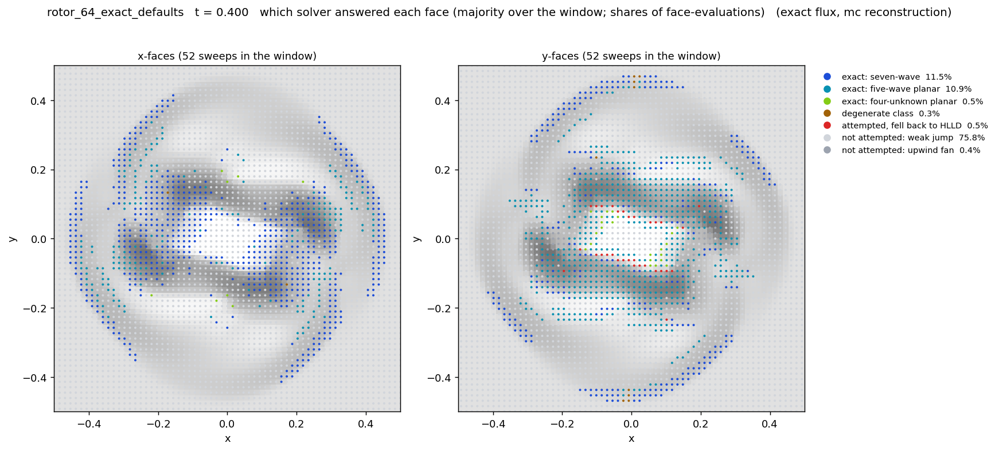

**The solution.** L1 against the 512² HLLD reference at t = 0.4
(`scripts/rotor_compare.py --regions`):

| 64² run | L1 rho | core | shell | outer | L1 p | front radius | symmetry error, final |
|---|---|---|---|---|---|---|---|
| HLLD | 0.2881 | 0.5726 | 0.3574 | 0.0745 | 0.2359 | 0.4882 | 5.9e-3 |
| production (exact; HLLD below the gate) | 0.2874 | 0.5724 | 0.3565 | 0.0740 | 0.2348 | 0.4881 | 1.6e-2 |
| linearised below the gate, no new rungs | 0.2880 | 0.5732 | 0.3573 | 0.0741 | 0.2351 | 0.4881 | 4.5e-3 |
| **defaults** | **0.2874** | 0.5728 | 0.3565 | 0.0738 | 0.2345 | 0.4879 | 1.1e-2 |

The defaults run differs from production by 1.3e-3 in L1(rho) (core 3.0e-3),
ten times the host-to-host noise but 1/200 of the gap to the reference,
which it leaves where production left it. Solving 3.2 points
more of the attempted faces is the claim this run measures. It does not
make the solution closer to the reference, as section 7 found for coverage
in general.

**The cost.** 411 s per step (calea01) against 50.6 s for the same weak flux
without the new rungs (`rotor_64_exact_linweak`, calea10, job 33659; same
pool, same harvest): 3.6x over the first 150 steps, 11.3x over the last 134,
where the attempted share is largest. The run kept 5.9 of its 64 cores busy
on average (Slurm TotalCPU / elapsed), the linearised run 34.6. The reason
is in the code: only the seven-wave Newton runs over the worker pool; the
five-wave rescue, its ladder and the four-unknown rung run in the main
process, lane after lane. Production's own 96 s per step
(`rotor_64_exact_prov`, older code 07dd058) is not the like-for-like
comparison.

**The rescues on the pool (2026-10-08, HLLD ad560a0).** `exact_pool.map_lanes`
runs the five-wave rescue, its ladder and the four-unknown rung over the
worker pool, chunked by lane like the seven-wave solve. On the held-out
windows with every rung on (calea job 38014; the same replay as the "defaults"
row below): everything in the main process 4238 s; the seven-wave solve over
the pool and the rescues in the main process -- the configuration of every
run so far, the 1561 s of the "defaults" row -- and everything over 32
workers 632 s and 630 s: **2.5x** on the rescues, 6.7x against no pool. The
three arms are bitwise equal in which solver answered, the star pressure and
every refusal reason. The 8x of the full run was this serial tail, not the
solvers; the per-rung costs below were measured before the change and stand
as relative costs.

What each rung costs, paired on the held-out windows (calea jobs 33951 and
33953; `failure_ledger.py collect --paired`, HLLD below the gate in all of
them, so the walls are the rungs' alone):

| configuration | rescue | ladder | crossed | four-unknown | edge scan | compound not offered to it | solved | gained / lost | wall |
|---|---|---|---|---|---|---|---|---|---|
| production | 1 | 0 | 0 | 0 | 0 | | 93.97% | | 569 s |
| **defaults** | 1 | 1 | 1 | 1 | 1 | 0 | **97.63%** | +614 / 0 | 1561 s |
| no ladder | 1 | 0 | 1 | 1 | 1 | 0 | 97.47% | +587 / 0 | 1114 s |
| no ladder, compound skipped | 1 | 0 | 1 | 1 | 1 | 1 | 97.15% | +534 / 0 | 1012 s |
| defaults, compound skipped | 1 | 1 | 1 | 1 | 1 | 1 | 97.41% | +577 / 0 | 1422 s |
| four-unknown rung without the five-wave rescue | 0 | 0 | 1 | 1 | 1 | 0 | 97.34% | +587 / −21 | 1062 s |
| the same without the edge scan | 0 | 0 | 1 | 1 | 0 | 0 | 97.18% | +559 / −21 | 985 s |

- The ladder buys 27 faces (+0.16 points) for 40% of the wall.
- Keeping the compound lanes from the four-unknown rung
  (`RMHD_PLANAR4_SKIP_COMPOUND=1`, opt-in) saves 9% of the wall and
  loses 37–53 faces. It answers compound lanes after all, though it
  certified none of the 100 tube-labelled ones (the rule is not the tube
  test). It stays off.
- The five-wave rescue cannot be replaced by the four-unknown rung: without
  it, 21 faces production solves are lost.

What the full ladder still loses on the ledger windows: 524 of 24,429
attempted faces (2.1%); the tube test calls 290 of them compound, 234
elementary (all but 35 were ledger R4). Two of them, run as 1D Riemann
problems with HLLE, HLLC and HLLD (`scripts/plot_two_faces.py`; the tube
runner takes `flux="hllc"` now):

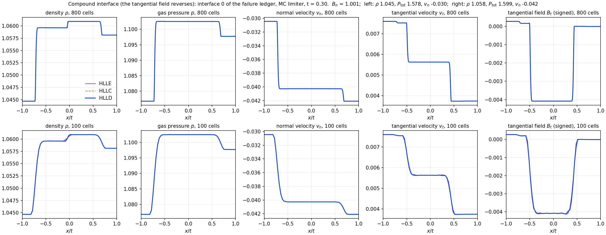
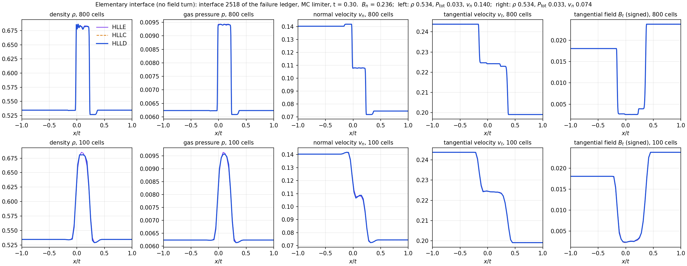

Interface 0 (compound): the slow waves carry the tangential field to −0.004,
reversed and fifteen times the left value -- a reversal fused to a jump,
not an elementary-wave structure. Interface 2518 (elementary): the states
differ by 6% in normal velocity, but between two strong slow waves the
density rises 27% and the field falls to a seventh. The three approximate
solvers differ by ~1% of each feature at 800 cells and a few percent at 100;
the HLLD fallback on these faces tracks the structure the PDE builds.

### The rungs, measured on held-out windows (2026-09-30)

*(All of the rungs in this section, the four-unknown solver and the
linearised flux below the gate are production defaults since 2026-10-01,
the user's decision; each is switched off with the value 0, the weak flux
with `RMHD_WEAK_FLUX=hlld`. The bitwise baseline was re-recorded on that
day.)*

Two windows production had never been recorded on (t = 0.175 and 0.325,
24 sweeps, 16,782 attempted, 93.97% exact), recorded with every switch off
and replayed with each switch on, paired lane by lane (calea job 33036;
the recording replays bitwise with the switches off, G0):

| switch | what it does | held-out: gained / lost | ledger windows |
|---|---|---|---|
| `RMHD_PLANAR5_LADDER=1` + `RMHD_PLANAR5_CROSSED=1` | six more planar starts on unsolved lanes; self-crossing refusals offered to the rescue | **+174 / 0** (93.97 → 95.01%, p = 8e-53) | |
| `RMHD_FAST_EDGE_SCAN=1` | the pair-splitting fast-shock search, on lanes the scan lost | **+12 / 0** (p = 5e-4) | +26 / 0 |
| all three | | **+188 / 0** (93.97 → 95.09%, p = 5e-57) | +222 / 0 (94.39 → 95.30%) |

No lane production solved changed its answer (largest star-pressure change
7e-10, on one lane of the ledger windows). Every gained answer went through
production's acceptance, since the switches only add starts and a search
the standard scan had already given up on. Gate G2 is met by all three;
they stay default-off until the user decides.

The ladder's starts were chosen on the ledger's windows, so its number
there (+192 possible) is in-sample; the held-out +174 is the one to quote.

---

## 5b. Is the answer UNIQUE?  Yes on the measured population — but the residual is a weaker certificate than it looks

A zero residual proves the answer is *an* admissible elementary-wave
solution. MHD does not promise only one, and nothing in the code had ever
checked. Two independent comparisons, both on the FULL answer (every zone,
every speed) rather than on the star pressure alone.

**Test 1 — two planar seeds with largely disjoint basins.** The default seed
and `+sqrt(2P)` reach different lanes (the second loses 1749 of 3619
controls), so where both converge they are independent routes to the answer.
On 2525 such lanes:

| | median | p99 | max | above 1e-8 |
|---|---|---|---|---|
| all four zones (physical scales) | 7.7e-12 | 4.1e-10 | 9.3e-10 | **0** |
| all five wave speeds (absolute) | 6.8e-13 | 8.7e-11 | 1.2e-09 | **0** |

Not one lane above 1e-8. Within the planar family the solution is unique to
solver tolerance.

**Test 2 — the seven-wave solver against the planar one**, on 5095 lanes
where the harvested answer carries no rotation and the planar solver
verifies. Here they do NOT always agree: median 4.3e-10, but **102 lanes
(2.00%) differ by more than 1e-6**, up to 9.2e-4 — and on all 102 *both*
answers pass the full seven-wave residual at 1e-8.

That looks like non-uniqueness. It is not. **It is conditioning**, and the
numbers say so:

| | routes agree | routes differ |
|---|---|---|
| planar 3x3, kappa | 8.0 | 12.7 |
| **seven-wave 6x6, kappa** | **32** | **7.9e+03** |
| harvested residual | 1.8e-10 | 5.1e-09 |

The seven-wave Jacobian is 246x worse conditioned on exactly the lanes that
disagree, and `kappa_7 x residual` predicts a state spread of 1.79e-5 against
1.13e-5 observed — the same order, the prediction slightly conservative. The
planar 3x3 kappa is ~10 on both groups and predicts 1.3e-7, 89x too small.
So the two routes find the SAME root; the seven-wave parameterisation merely
localises it ~250x more poorly there. (kappa_7 reaches 1.0e10 on the worst
agreeing lane, so this is not a tail effect — it is the coplanar
ill-posedness the planar solver was built for, showing up in the certificate
rather than in the convergence.)

**Three consequences, and they matter for the paper.**

1. **Uniqueness is supported** on the measured population — no evidence of a
   second admissible elementary-wave solution anywhere in 7620 compared
   lanes.
2. **"Verified at 1e-8" is a statement about the residual, not the state**,
   and the conversion factor is the parameterisation's condition number. In
   the planar form a 1e-8 residual pins the state to ~1e-7; in the seven-wave
   form, on 2% of coplanar lanes, only to ~1e-4. The paper must say which.
3. **This is an independent argument for making the planar solver primary**
   (Sect. 4's plan item): not merely 4x cheaper and needing no warm start,
   but a materially better-localised answer on the population the rotor
   actually presents.

## 5c. A gap in the definition: the jump conditions do not order the waves

Verification checks that the state behind the flux satisfies the seven-wave
jump conditions. It does NOT check that the seven waves are ordered in space,
and they are not always: a fan whose Alfven wave sits to the right of its slow
wave is self-crossing and is not a Riemann solution however small its
residual.

Measured over 24,632 production rows, separating the harmless case from the
real one -- a crossing between ZERO-strength waves changes nothing, because no
state depends on where a wave with no jump sits:

| | production | rescued (planar path) |
|---|---|---|
| LA carries a jump | 5.6% | 0.0% |
| LA crosses LS | 10.0% | 89.8% |
| **crossing AND carrying a jump** | **2.52%** | **0.03%** |
| usable | 97.48% | 99.88% |

So **2.52% of interfaces counted as verified-exact in production are
inadmissible fans.** The rescued rows are almost all clean despite crossing
far more often, because the planar path leaves both rotations at zero strength
by construction.

**Both paths now gate on it.** `scripts/rescue_collect.py` and the production
`exact_flux_batched` (`RMHD_WAVE_ORDER`, default on, reported as
`n_wave_order_rejected`). Measured on 3000 real interfaces in the run's true
solved/failed proportion:

| | gate off | gate on |
|---|---|---|
| n_exact | 1248 | 1215 |
| rejected as self-crossing | 0 | **33 (2.64%)** |
| coverage of attempted | 66.70% | 64.94% |

The rejected lanes' fluxes change by a factor of order 500 when they fall back
to HLLD. These were not marginally wrong, they were nonsense --- which is what
a self-crossing fan should produce --- and the residual check passed every one.

**Re-measured 2026-09-10 (`rotor_64_p5wo`, 284 steps, one variable changed).**
The central result is unaffected and is safe to cite:

| A | B | L1(rho) at t = 0.4 |
|---|---|---|
| rotor_64_hlld (no exact flux) | rotor_128_hlld | 3.284e-01 |
| rotor_64_p5 (gate off) | rotor_128_hlld | 3.275e-01 |
| **rotor_64_p5wo (gate on)** | rotor_128_hlld | **3.278e-01** |

0.03 points of 32.8, marginally the wrong way. Removing the bad fluxes does
not rescue exact-at-N ~ HLLD-at-2N.

**The gate pays on a different metric.** Symmetry error -- the drift from a
symmetry the rotor's initial condition genuinely has -- improves **6.8x**:
final 1.089e-02 with the gate against 7.391e-02 without (max over the run
6.77e-02 against 8.45e-02). That is what deleting fluxes wrong by ~500x on
2.6% of interfaces should do: almost nothing to an L1 norm measured against a
reference 33% away, and a visible reduction in the scheme's own
inconsistency. It is the better argument for the gate than coverage is.

### 5d. The legacy scalar `solve_riemann` can converge to a non-solution (2026-09-24)

`rmhd.solver.solve_riemann` -- the Fortran-port entry point that answers the
13 built-in test cases, NOT the path any run or harvest uses -- carries four
unknowns when `Bx != 0` (`p_LF, By_CD, Bz_CD, p_RF`) and a multistart that
enumerates the Alfven branches. Its residual covers those four equations and
says nothing about the tangential FIELD at the contact, so it can report
convergence on a state that is not a solution.

Measured over all 13 cases, checking the contact directly -- across a
contact only the density jumps, so v_x, the total pressure, the tangential
velocity and the tangential field must all be continuous:

| cases | contact defect |
|---|---|
| 1-11, 13 | 6e-13 ... 2.3e-10 |
| **12 (Balsara 5)** | **4.7e-5 on calea, 1.2e-4 on the laptop** |

All of case 12's defect is in the tangential field (By 6.7e-4, Bz 3.3e-4)
while its own `|fvec|` is 3.9e-11. And it is not only a residual: the
production six-unknown batched solver converges on this problem on its FIRST
attempt from the network seed, full residual 7.4e-11, contact 1.3e-11 -- and
its answer differs from the scalar one by **7.3e-3 in Bz (1.3%)** and 1.3e-3
in the star density. So the scalar answer is wrong at the percent level in
one component, with a converged flag and a 4e-11 residual to show for it.
That the defect differs between hosts (4.7e-5 / 1.2e-4) is the same
branch-chaos this path is known for: 1-ulp library differences send the
multistart to another Alfven branch.

The cause is the slow-wave over-determination described in section 3: each
slow wave is prescribed BOTH tangential components while its family has one
parameter, so the left slow wave need not reach the prescribed `Bt_CD`, and
in the four-unknown form nothing asks it to.

**Fixed by refusing, not by hiding.** `solve_riemann` now computes
`contact_defect`, returns it in its result dict, and when it exceeds
`CONTACT_TOL = 1e-8` sets `converged = False` and warns, naming the batched
solver. With `Bx = 0` the contact is a tangential discontinuity and the field
may legitimately jump, so only v_x and the total pressure are checked there.

**Scope.** Nothing else depends on this path: the rotor runs, the harvest
and every coverage number in this document go through
`exact_flux_batched`, and the Balsara 5 figure
(`scripts/balsara5_slowwave.py`) builds its exact solution from the batched
six-unknown solver. The 13-case demonstration is the only consumer.

## 6. Are the waves resolved properly?

Two integrations, and only one of them is certified by the residual.

**The fan endpoints are certified.** `fast_wave` and `slow_wave6` integrate
through the rarefaction to reach the post-wave state, and that state is what
the jump conditions test. A residual of 1e-10 certifies the endpoint to that
tolerance.

**The fan interior is a separate code path** — `ray_b.state_at_xi` marching to
an arbitrary xi with `n_refine` steps — and it is what produces the flux
whenever xi = 0 falls inside a fan. It had never been measured. It is fine:

*Self-convergence*, against `n_refine = 320`:

| n_refine | median | p95 | max |
|---|---|---|---|
| 5 | 7.9e-02 | 1.1e-01 | 1.1e-01 |
| 10 | 1.5e-03 | 2.3e-03 | 2.4e-03 |
| 20 | 1.3e-06 | 3.2e-06 | 3.2e-06 |
| **40 (default)** | **1.4e-12** | 3.2e-12 | 4.2e-12 |
| 80, 160 | 0.0 | 0.0 | 0.0 |

*Edge anchoring.* A rarefaction is continuous at head and tail, so the error
against the constant state outside must vanish **with** the distance d into
the fan. A plateau would be systematic error. Measured over five decades:

| d / width | 1e-2 | 1e-3 | 1e-4 | 1e-5 | 1e-6 | 1e-7 |
|---|---|---|---|---|---|---|
| median | 2.808e-2 | 2.790e-3 | 2.788e-4 | 2.788e-5 | 2.788e-6 | 2.788e-7 |

Exactly proportional, no plateau. The fans are correctly anchored and
converged at the default setting.

**Caveat on the statistics.** xi = 0 lands inside a fan on only 15 of 400 and
23 of 600 interfaces in these samples, so the sample is small even though the
scaling is unambiguous. A larger measurement would be cheap if the claim ever
needs to be load-bearing.

---

## 7. The result that matters

**Higher coverage does not improve the solution, and the central claim of the
project is refuted.** L1(rho) at t = 0.4, `scripts/rotor_compare.py`:

| A | B | L1(rho) | A's exact coverage |
|---|---|---|---|
| `rotor_64_hlld` | `rotor_128_hlld` | 32.84% | 0% |
| `rotor_64_exact` | `rotor_128_hlld` | 32.78% | 43.9% |
| `rotor_64_p5` | `rotor_128_hlld` | **32.75%** | **78.0%** |
| `rotor_64_p5` | `rotor_64_hlld` | 0.483% | — |
| `rotor_64_p5` | `rotor_64_exact` | 0.224% | — |
| `rotor_128_exact` | `rotor_256_hlld` | 26.82% | — |
| `rotor_128_hlld` | `rotor_256_hlld` | 26.75% | — |

The exact flux at N does **not** match HLLD at 2N. Going from 0 to 78.0%
coverage moves the gap by 0.09 points out of 32.8; doubling coverage — the
entire purpose of the five-wave solver — bought 0.03. The fast-front radius is
identical (0.4766) in every same-resolution pair (the cell-centre value
`rotor_compare.py` reported until 2026-09-26; it now interpolates the
threshold crossing by default, which puts the 64^2 front at 0.4882 --
`front_radius(..., interpolate=False)` gives the old number). At 128² the exact flux is
marginally *worse* against the 256² reference.

The arithmetic explains it. The exact flux owns 11.0% of interfaces and
changes the solution there by ~0.5%, against a 32.8% resolution gap — a factor
of 68. Improving the 11% cannot close it.

**This does not impugn the solver.** Every exact flux is verified against the
complete seven-wave jump conditions at 1e-8, and this document is largely a
record of how thoroughly that has been checked. The result is about what a
flux function can contribute to a 2D finite-volume solution.

**Where the work should go.** The error budget is dominated by something other
than the flux.

**Correction (2026-09-09).** An earlier draft of this section said the rotor
runs *piecewise-constant* reconstruction. That is wrong. `run_2d.py` defaults
to `--limiter mc` (monotonized central) and `calea_rotor_exact.sh` does not
override it, so the production runs are **piecewise-linear, second order**.
This also explains a discrepancy found while measuring the gate: a raw
cell-to-cell sweep of the final snapshot puts 87.3% of interfaces above the
gate, against 13.8% in the run — MC reconstruction shrinks the face jumps.

So "try a higher-order reconstruction" is not the obvious next experiment; the
scheme is already second order. The open question is sharper than it looked:
whether going to third order or beyond (PPM, or a genuinely higher-order CT
scheme) changes the balance, or whether the exact flux simply cannot matter at
these resolutions for a scheme of this class.

### Higher-order reconstruction, measured (2026-09-26, corrected 2026-09-28) — WENO5-Z wins at 256², the MP schemes lose

The question above, answered. Five reconstructions -- PCM (first-order
Godunov, no reconstruction), PLM (the production MC limiter), WENO5-Z, MP5 and
MP7 (Suresh & Huynh's monotonicity-preserving schemes at fifth and seventh
order) -- each run on the rotor with the HLLD flux at 64^2, 128^2 and 256^2,
everything else fixed, all on one calea node type. Measured against a 512^2
reference at t = 0.4 (`scripts/recon_study.py`; calea jobs 2081, 2083, 2085,
2092).

**The reconstruction moves the rotor twenty-four times more than the Riemann
solver does.** Changing PLM to MP5 moves L1(rho) by 11.7% at both 64^2 and
128^2; switching on the exact seven-wave flux moves it by 0.5% on the
interfaces it owns. At these resolutions the scheme's accuracy belongs to the
reconstruction.

**Which higher order matters more than whether.** Error against the
reference, L1(rho):

| reconstruction | 64^2 | 128^2 | 256^2 |
|---|---|---|---|
| PCM (1st) | 35.9% | 37.9% | 26.5% |
| PLM (2nd, production) | 28.8% | 30.3% | 12.8% |
| **WENO5-Z (5th)** | **28.7%** | **30.0%** | **11.5%** |
| MP5 (5th) | 31.1% | 32.7% | 13.6% |
| MP7 (7th) | 32.2% | 33.1% | 15.2% |

PCM is clearly worst, so reconstruction matters.  Above second order the two
families part ways.  **WENO5-Z** ties PLM at 64^2 and 128^2 and at 256^2 beats
it by 10% relative -- in L1(rho), L1(p) (8.28% against 8.41%) and L1(|B|)
(4.90% against 5.25%), and in every annulus (core r < 0.2: 15.6 against 17.4;
shell 0.2-0.4: 18.4 against 20.5; outer r > 0.4, which carries the outflow
boundary and the schemes' different ghost widths: 1.91 against 2.00) -- for 9%
more wall time.  It does so against a PLM reference, which flatters PLM.  The
**MP schemes** lose to PLM at every resolution, and MP7 more than MP5.

*Correction.* This section first appeared (2026-09-26) with WENO5-Z at 64^2
only, where it ties PLM, under the heading "second order is best".  The 128^2
and 256^2 WENO5-Z runs (calea job 32165) overturned that: what fails is the
MP limiter, not order as such.

**And the MP schemes are not robust on this problem.** They drive the
pressure to exactly zero at every resolution (PLM's minimum is 4.5e-3 to
5.4e-3, WENO5-Z's 5.1e-3), so the positivity floor fires and those faces fall
back to first order. They break the rotor's pi-rotation symmetry -- exact in
the continuum, so every bit of the violation is numerical -- by a margin that
GROWS with resolution: at 256^2 MP5's worst cell is off by 1.2 relative and
3.7% of cells by more than 5%, against 0.035 and none for PLM. Their dense
shell does not converge: between their own 128^2 and 256^2 runs it changes by
72% (MP5) and 74% (MP7), against 58% for PLM -- the knots rearrange instead of
sharpening in place. And at 512^2 **both fail outright**: MP5 went non-finite
at t = 0.113 and MP7 at t = 0.270, while PLM and PCM complete the problem.
WENO5-Z, of the same order as MP5, keeps the pressure and density minima at
PLM's level (p_min 5.2e-3 at every resolution) -- the instability belongs to
the MP limiter, not to the order.  It is not free of the symmetry problem,
though: its worst violation at 256^2 is 0.15 against PLM's 0.09, with 0.28% of
cells off by more than 5% (MP5: 0.64 and 3.7%).  **And WENO5-Z completes the
problem at 512^2** (calea job 32167: 2,736 steps, 6.4 h, finite throughout,
end-of-run symmetry error 0.45 against PLM's 0.48 at the same resolution),
where MP5 and MP7 both went non-finite.

**Cost.** The MP schemes buy nothing: MP5 at 256^2 (7742 s) is beaten by PLM
at 256^2 (6933 s), MP5 at 128^2 (1841 s) by PLM at 64^2 (254 s).  WENO5-Z at
256^2 (7533 s) is the most accurate run measured, at 9% more cost than PLM at
the same resolution.

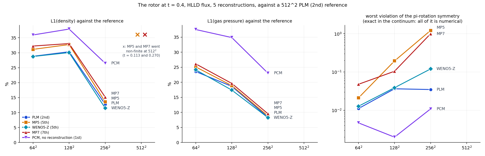

*PDF for the paper: `figs/recon_study.pdf`.*

**Three caveats, all stated on purpose.**

- **The reference is PLM, and flatters PLM -- so it was swapped.** The plan
  was an MP5 reference; it could not be made, because MP5 does not complete
  the problem at 512^2.  WENO5-Z does, which gives a second reference with
  the opposite bias.  Against it, at 256^2: WENO5-Z 12.28%, PLM 13.91%, MP5
  14.36%, MP7 15.95%, PCM 26.66% -- the SAME ranking, and WENO5-Z ties PLM at
  64^2 and 128^2 under both.  The two references bracket WENO5-Z's lead at
  256^2 at **10-12%**, each bounding the other's bias.  The MP schemes'
  failures (the pressure floor, the growing asymmetry, the blow-up) do not
  depend on any reference at all.
- **L1(rho) is partly saturated.** From 64^2 to 128^2 the observed order is
  -0.07 for every scheme -- doubling the resolution does not reduce the error
  against a fixed finer reference -- and only from 128^2 to 256^2 does it move
  (order 1.25 for PLM and MP5, 0.52 for PCM). So the resolution TREND is weak.
  What is robust is the RANKING of the schemes at fixed resolution, which is
  the same in every field and every annulus. This check was preregistered in
  the plan before the reference existed, so that a saturated metric could not
  later be read as a result.
- **One host, not bit-reproducible across hosts.** A 64^2 PLM run made on the
  laptop and one made on calea agree to 1.5e-15 at t = 0.05 and drift to
  1.4e-4 in L1(rho) by t = 0.4 -- chaotic growth, not a code change. Every run
  in this table was made on calea for that reason; the scheme differences are
  whole percent, two orders above it.

**Found on the way: a failed run used to look like a finished one.**
`run_2d.py`'s time loop is `while t < tend`, and a NaN dt makes that false,
so the MP5 512^2 run ended "normally", wrote `snap_fin.npz` and exited 0 with
every cell NaN -- and was about to be used as this study's reference. A
non-finite dt or conserved state now aborts with a non-zero status and no
`snap_fin` (`tests/test_high_order_2d.py::test_a_non_finite_run_fails_instead_of_finishing`);
the MP7 512^2 run then failed loudly, as it should.

**What this means for the paper.** The exact Riemann solver was never the
limiting factor at these resolutions: the reconstruction moves the rotor 24x
more.  Among reconstructions, WENO5-Z is the one worth having -- it matches
PLM at coarse resolution and wins by 10% at 256^2, while the monotonicity-
preserving schemes are less accurate and unstable.  Even so, most of the gap
closes with resolution, not with order (64^2 -> 256^2 takes WENO5-Z from
28.7% to 11.5%).  The hybrid exact solver's case rests on being exact where
it is used (section 1), not on moving the global error.

### The HLLD star-pressure root-finder: secant, not Newton (2026-09-27)

Relativistic HLLD is not closed-form: the star-region total pressure p* is
the root of Mignone's pressure-balance residual (Mignone, Ugliano & Bodo
2009).  `hlld_flux` finds it with a **clamped secant** --
`safe_secant_bisection`, whose name is historical: it does no bisection.  It
is seeded from Mignone's two estimates (the B_n = 0 quadratic, eq. 55, or the
HLL pressure, chosen by eq. 53) as a pair +-1% apart, widens the pair up to
five times until the residual changes sign, and iterates to |f| < 1e-10.  A
lane that does not converge, or whose root fails the wave-ordering check,
falls back to HLLE.

Newton-Raphson was tried against it, opt-in via `RMHD_PSTAR_METHOD`
(`src/physics/hlld.py::newton_pstar`), with four derivatives: exact by
autograd (the residual is plain torch), autograd kept inside the sign-change
bracket (the "rtsafe" safeguard), central difference, and a forward
difference from two close values p and p + h.  Measured on the production
interface states of the 128^2 PLM rotor at t = 0.1, 0.25 and 0.4 (105,336
interfaces, `scripts/pstar_methods.py`), and end to end on the 64^2 rotor to
t = 0.4 (calea jobs 2152, 2153):

| method | wrong-order fallback | iterations | batched evals | wall, 128^2 | 64^2 rotor |
|---|---|---|---|---|---|
| **secant** (production) | **0.31%** | 3.50 | **158** | **1.94 s** | **238 s** |
| Newton, two close values, h = 1.5e-8 | 3.54% | 3.18 | 294 | 2.82 s | 312 s |
| Newton, bracketed, autograd | 3.14% | 3.20 | 190 + 78 backward | 2.55 s | 353 s |
| Newton, autograd | 3.69% | 3.18 | 639 + 104 backward | 5.28 s | 400 s |
| Newton, central difference | 3.54% | 3.27 | 1068 | 7.08 s | 787 s |

(The total HLLE fraction is ~11% for every method, because faces with B_n = 0
fall back by design; the method-dependent part is the wrong-order column.)

**Newton saves 0.3 iterations and loses everything else.** Every variant is
slower, and every one sends ten times as many interfaces to HLLE as unphysical.
Two mechanisms, separated on the 64^2 interfaces: in 85% of the lost cases
Newton converges -- genuinely, |f| < 1e-10 -- to a DIFFERENT root of the
multi-rooted residual, a median 17% away in p*, which the wave-ordering check
then rejects; in the other 15% it finds the same root to 1e-8 and the
ordering check still flips, on near-trivial interfaces where the waves are
degenerate and the check sits on a knife edge.  Keeping Newton inside the
bracket barely helps, because the bracket itself can hold more than one root.

The step size of the two-close-values derivative behaves as numerical
analysis says it should: h = 1e-4 (too coarse) sends 17% to HLLE, h = 1e-10
(round-off) triples the evaluations, and at h = sqrt(eps) = 1.5e-8 it matches
the exact derivative.  So the derivative is not what holds Newton back.

**Why the secant wins.** The secant IS Newton with a derivative taken from two
values -- only the choice of the second value differs.  The secant pairs p
with the previous iterate, which is free; the finite-difference Newton pairs
it with a fresh point just beside it, which costs an evaluation and gives a
sharper local slope.  On a residual with several roots the sharper slope makes
for bolder steps, and the bolder steps land on neighbouring roots.

**And it is not a detail.** End to end, the choice of root-finder moves the
64^2 rotor by 0.7-0.9% in L1(rho) at t = 0.4 -- more than switching on the
exact seven-wave flux does (0.5%), and fifty times the cross-host noise.
The secant stays the default; Newton remains available, opt-in, for anyone
who wants to repeat this.

### Orszag–Tang: the second problem, measured (2026-10-03 to 10-06)

The relativistic Orszag–Tang vortex (γ = 4/3, periodic, v_max = 0.99,
`initial_data2d.orszag_tang`), 64², every rescue step on, to t = 1: 654
steps in 61.6 h on one calea node (339 s per step; HLLD at 64² takes 0.82 s
per step, the 512² HLLD reference 7.9 s). Like the rotor, every face is
coplanar (no z-components), so the planar solvers answer half of what is
attempted; unlike the rotor, the magnetisation stays below ~1.6, and the
exact solver is offered about twice the share of faces.

**Every face of the run** (`results/ot_64_exact`, 3,924 sweeps, 18.4 M
face-evaluations; the rotor's numbers from 5a beside them):

| | Orszag–Tang | rotor |
|---|---|---|
| below the weak-jump gate / fan entirely upwind | 72.6% / 4.6% | 85.9% / 2.0% |
| attempted by the exact solver | 22.8% | 12.1% |
| of the attempted: seven-wave / planar / four-unknown / degenerate | 45.2 / 50.7 / 0.8 / 0.6% | 43.8 / 50.5 / 2.3 / 1.1% |
| left to HLLD | 2.71% | 2.28% |
| **solved** | **97.29%** (4,083,387 of 4,197,235) | 97.72% |

Recorded windows paired the way the rotor's were (t = 0.25, 0.5, 1.0; 36
sweeps, 46,270 attempted; `results/ot_ledger_64`, calea job 34694): the
production settings of 2026-09 solve 97.30%, every rung on 97.84% (+251 /
−0). The remaining failures look like the rotor's: the field nearly normal
to the face (median |Bn|/|Bt| 5.3 against 1.0 on solved faces), about half
reversing, and at LOW magnetisation (median 0.014 against 0.084).

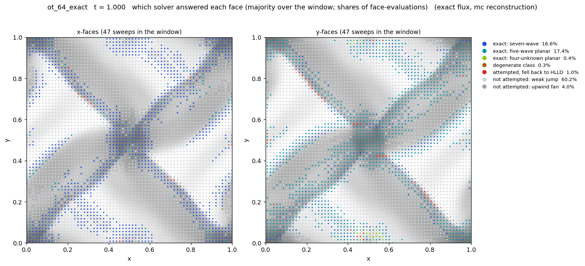

**The solution.** L1(rho) against the 512² HLLD reference, cell-averaged to
64² (`scripts/rotor_compare.py`, global; the rotor's annuli do not apply):

| t | exact 64² | HLLD 64² | exact vs HLLD at 64² |
|---|---|---|---|
| 0.25 | 0.0205 | 0.0201 | 0.09% |
| 0.375 | 0.168 | 0.171 | 1.5% |
| 0.5 | 0.191 | 0.195 | 1.4% |
| 0.75 | 0.250 | 0.252 | 1.8% |
| 1.0 | 0.264 | 0.263 | 2.3% |

The exact flux moves the 64² solution by up to 2.3% -- four times what it
does to the rotor -- and between t = 0.375 and 0.875 that move is towards
the reference, by 0.2–2% of the gap; at t = 1 it is not. The gap itself,
26%, is resolution, as for the rotor (section 7's conclusion stands for a
second problem). Caveat on the reference: in up to ~400 of its 262,144
cells (0.15%, around t = 0.75; 38 at the end) the primitive recovery did not
converge to its tolerance; the 64² runs had none.

**Networks at γ = 4/3.** The production networks were trained at γ = 5/3.
A million coplanar Orszag–Tang solutions at γ = 4/3 (rmhd_final
`data/dataset_ot43_coplanar.npz`) trained ten networks (two on calea's CPUs,
eight on one Goethe GPU node; small, mid and 25M, from scratch and warm
started). On 600 real Orszag–Tang faces (`data/proxy_ot43_600.npz`, one
seven-wave attempt at γ = 4/3) the production networks already converge on
37.3–38.5% against a ceiling of ~40.5% -- only the faces the seven-wave
solver can solve at all count, 92–95% of which they already get -- and every
new network lands at 39.0–40.2%. Paired on fresh windows (t = 0.375, 0.75;
27,760 attempted; production settings of 2026-09):

| networks | solved | vs recording | wall | seven-wave iterations per solved face |
|---|---|---|---|---|
| production (γ 5/3) | 26,655 (96.02%) | identical | 764 s | 12.4 |
| small γ 4/3 primary | 26,648 | +20 / −27 | 739 s | 11.7 |
| mid γ 4/3 primary | 26,646 | +13 / −22 | 738 s | 11.6 |
| three 25M γ 4/3 | 26,638 | +40 / −57 | 748 s | 10.3 |

The new networks save retries and iterations, not faces: each loses a few
more than it gains (none significant), all of them seven-wave answers
refused as self-crossing fans. With every rung on (the production defaults;
calea job 35849) the crossed offer hands those to the planar solver and the
arms become indistinguishable: 26,975 solved (97.17%) with production's
networks and with the small γ 4/3 one -- the same faces, the same first-guess
share of 41.8% -- 26,974 with the 25M trio; walls 1664 / 1659 / 1661 s. No
network is promoted. The rotor's lesson holds for the second problem: where
the seed matters the production networks are already at the ceiling, and
where they fail no seed helps. (Goethe's eight runs, job 1788856, all
selected at 0.390–0.402 on the proxy, network size and warm start
notwithstanding.) One face in the small-network arm converged to a
different exact root, its star pressure 0.85% from production's: one in
27,760, not investigated.

**How low the loss can go: a second-order optimizer (2026-10-06).** The
small and mid γ 4/3 networks were continued from their Adam checkpoints
with full-batch L-BFGS (strong-Wolfe line search, the same data, split,
scaler and loss; `rmhd_final/scripts/finetune_lbfgs.py`, calea job 36031).
Nothing moves: the small network's validation loss 0.03411 → 0.03408 and
training loss 0.03300 → 0.03286 over 335 L-BFGS iterations (1,548 loss
evaluations: the line searches fail, the loss is flat to float32 at the
Adam point), the mid network's 0.01704 → 0.01704 over 510 iterations; the
validation errors are the Adam checkpoint's to three digits (log p 0.082,
log |B_t| 0.225). The Adam solutions sit at the minimum these
architectures and this data admit, so the seed error is capacity- and
data-limited, not optimizer-limited -- and the seed test above says a
lower seed error would buy retries, not faces.

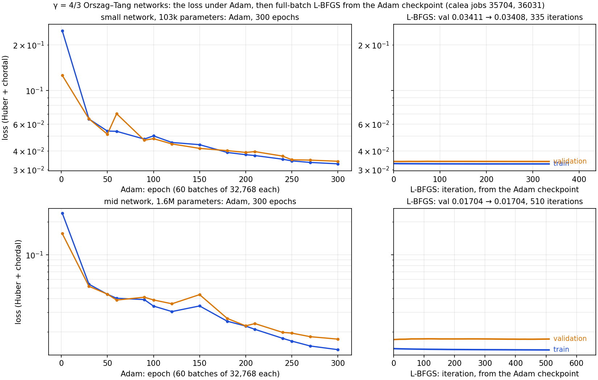

### The four-quadrant Riemann problem with a field (2026-10-06)

Kiuchi et al. (2022) show the relativistic four-quadrant Riemann problem of
Del Zanna & Bucciantini (2002) resolving tangential discontinuities under
HLLC that HLLE smears. No RMHD version of it is published (the RMHD codes
checked -- Mignone & Bodo 2006, Zanotti et al. 2015, Balsara & Kim 2016,
Mattia & Mignone 2022, CAFE -- run the hydro one or none), so
`initial_data2d.riemann2d` makes one: the published quadrants, (rho, p, vx,
vy) = (0.1, 1, 0.99, 0) top left, (0.1, 0.01, 0, 0) top right, (0.5, 1, 0, 0)
bottom left, (0.1, 1, 0, 0.99) bottom right, on [−0.5, 0.5]² with outflow
boundaries, γ = 5/3, to t = 0.4, threaded by a uniform in-plane field
B = B₀ (cos 45°, sin 45°, 0) from a vector potential (div B = 0 to
round-off). B₀ = 0.5 puts the magnetic pressure between the two gas
pressures: magnetisation 0.05 in the moving quadrants, 2 in the top right
(plasma β 0.08). Every face carries a normal and a tangential field; the
flow is coplanar like the rotor's. The two shear layers become Alfvén and
slow structures once the field threads them, and the jumps along both axes
are strong from the first step (W = 7 across the shear), so the exact
solver is exercised at once. `--problem riemann2d --b0 0.5` in `run_2d.py`,
`PROBLEM=riemann2d` in the launchers and the sweep recorder.

**What the first run exposed: the primitive recovery.** The 16² smoke run
flagged half its cells as unconverged recoveries at every step. The cause
is in `c2p.py`, not the problem: the Kastaun inversion's bracketed secant
creeps on one side of the root for hot, fast gas, and its 60-iteration cap
stops it at a 1.2e-6 relative error in rho and p on (rho, p, v) = (0.1, 1,
0.99), with or without a field, at any tolerance; 120 iterations converge
it. On 2,000 random states (rho 0.1–10, p 0.01–10, v < 0.995, |B| < 2) the
secant left 187 (9.4%) at up to 2.1e-5 -- W median 1.8, p/rho 2.5, so not
only the relativistic corner. That is what `c2p_bad` had been counting in
every run (the rotor: ~3% of cells late in the run; the 512² Orszag–Tang
reference: ~400 cells at t ≈ 0.75), and what `test_c2p_highly_relativistic`'s
expected failure since 2026-09-16 was. The fix re-solves the cells the
secant leaves unconverged by plain bisection on that subset
(`KastaunC2P.invert_bisection`); the cells it converges are untouched and
bitwise what they were (checked on the same batch). The hot states now
recover to 1e-11, the random batch's leftovers to 2e-13, the smoke run and
the 32² pilot report no failed recovery, and the old expected failure
passes. Old runs with `c2p_bad > 0` are not bitwise reproducible with the
fix; the OT and rotor numbers above stand as measured. One subtlety kept:
the secant steps a converged cell on while its batch mates converge and can
push it back off the tolerance, so which cells reach the continuation can
depend on the batch (as the flag always did); the continuation itself runs
a fixed number of halvings and is batch-independent, which the tube tests
require of a column.

**The run (2026-10-07, calea job 36227).** 64², every rung on, 369 steps to
t = 0.4 in 24.1 h (235 s per step; the 64² HLLD run 1.4 s, the 512² HLLD
reference 15.7 s). Every face of it (2,214 sweeps, 10.4 M face-evaluations),
beside the rotor and Orszag–Tang:

| | four-quadrant | rotor | Orszag–Tang |
|---|---|---|---|
| attempted by the exact solver | 10.4% of faces | 12.1% | 22.8% |
| of the attempted: seven-wave / planar / four-unknown / degenerate | 38.9 / 53.4 / 0.7 / 0.1% | 43.8 / 50.5 / 2.3 / 1.1% | 45.2 / 50.7 / 0.8 / 0.6% |
| left to HLLD | **6.97%** | 2.28% | 2.71% |
| **solved** | **93.03%** (1,003,070 of 1,078,248) | 97.72% | 97.29% |

Three times the rotor's loss, and it is not the field strength: the solver
map puts the fallbacks on one column of faces beside each shear line -- the
x-faces just right of x = 0 for y < 0 and the y-faces just above y = 0 for
x < 0 -- from the first steps to the last, in equal measure on x- and
y-sweeps (93.07% / 92.99%). The solved fraction dips to 86% in the third
tenth of the run and recovers to 95% by the end. (A first reading took
these for the faces carrying the 0.99 c shear; the run's harvest says
otherwise -- the faces it lost carry almost no tangential-velocity jump and
sit inside the moving quadrants, below.)

**The ledger on recorded windows (2026-10-08, calea job 38013;
`results/failure_ledger_r2d`).** Windows at t = 0.1, 0.2 and 0.3, two steps
each (36 sweeps), pre-evolved with HLLD as the recorder does: 17,422
attempted faces, 97.37% solved, 458 failing; the replay reproduces the
recording (G0). R1 1, R2 7, R3 3, **R4 447** (97.6% of the failures); the
tube test calls 32 of them compound; no method finds another root on the
1,188 controls. The 415 elementary R4 faces of these windows are
weak-field, strong-jump faces: magnetisation 0.009 against the controls'
0.17, pressure jumps of 30% against 3%, gas pressure above the networks'
training envelope on 72% of them, and an Alfvén–slow speed gap of 1.3e-5
against 1.5e-3 -- above the classifier's merge tolerance (1e-8), so they go
to the seven-wave solver; on a 48-face sample neither a planar seed built
from the post-fast-wave field nor the four-unknown rung converges.

**But that is not the exact run's population.** The recorder pre-evolves
each window with HLLD, and on this problem the exact run's state differs and
so do its losses. Its harvest identifies every face the run finally lost --
an unsolved row with no planar-solved twin in the same shard: 84,049,
against 83,108 expected from the coverage (the few extra are rows whose
rescue landed in the next shard). Against the faces it solved:

| median | the run's lost faces | its solved faces |
|---|---|---|
| tangential-velocity jump | 0.000 | 0.013 |
| Lorentz factor | 6.4 | 1.3 |
| density jump | 3.6% | 2.8% |
| magnetisation | 0.045 | 0.12 |

They are the first faces inside the two 0.99 c quadrants, beside the shear
lines -- the red columns of the solver map: a nearly uniform state moving at
W ≈ 7 along the face, with a small jump on it. The slow and Alfvén speeds
are no closer there than elsewhere (the gap is below 1e-4 on 22% of them,
and on 31% of the faces the seven-wave solver solved). All but 62 failed
"not converged" in the seven-wave solve (the 62: self-crossing fans), and
the planar rescue was offered -- the planarity residue is 1e-11, far below
its 1e-6 -- and did not converge either. The windows' 97.4% against the
run's 93.0% is this difference in states: the run's own tenth around
t = 0.1 solved 86%.

**The ledger on the run's own faces (2026-10-09; calea jobs 38139 and
38256; `results/failure_ledger_r2d_run`).** `failure_ledger.py
collect-harvest` sampled 1,200 of the faces the run lost and 1,200 it
solved from its harvest and replayed them through production's path:
1,081 of the lost are lost again (the other 119 are the four-unknown and
degenerate rungs' answers, which the harvest does not keep as solved rows)
and none of the solved. Offered to every method:

| verdict | lost faces | of the lost |
|---|---|---|
| R1 a cheap method (seven-wave from diverse seeds; planar from 24 starts) | 0 | 0.0% |
| R2 only the expensive search (ε-ladder, tube seed) | 17 | 1.6% |
| R3 only the intermediate-shock branch | 35 | 3.2% |
| **R4 nothing** | **1,029** | **95.2%** |

The tube test calls 34 of them compound (3.1%), and no method finds
another root on the 1,319 controls (one wide-window answer moves p* by more
than 1e-3). On the rotor R4 was 74% of the failures and a third of it
compound; here almost every loss is an elementary face nothing in the chain
closes. Of the run's attempted faces at most 0.3% could be won back with
what exists (4.8% of its 6.97% losses), 0.1% without the intermediate
branch.

Why, on all 1,081 and on probes of 48: the seven-wave Newton's best
residual is a median 1.8e-2, a convergence failure and not a precision
floor. The faces sit in flow at W ≈ 6.4 with magnetisation 0.045 and an
Alfvén–slow speed gap of 2e-4. The linearised decomposition puts the slow
waves at a few percent strength, the largest after the fast waves, moving
with their Alfvén waves on both sides with the contact between them; the
whole inner fan is 0.01 wide. From a start read off that linearised
solution the planar solver cannot even build the waves: the left slow wave
must lower the tangential field by 5.6% (a compressive slow shock), and
the slow-shock construction admits drops up to about 0.5% (it fails on 31
of 48 at 2%). With the window opened (margin 1.0) the waves build, but
Newton converges on 1 of 48; the ledger's wide-window method recovers 3.2%.
More starts do not help either: the K-candidate network, which no ledger so
far had (it was never on calea, and the seed loader resolves it against the
rmhd checkout), raises method a's starts from 3 to 7 per face and recovers
0 of the 1,081 (job 38250). Closing these faces needs a formulation for a
slow wave travelling with its Alfvén wave in fast tangential flow; neither
seeds nor the existing branches provide it.

27 of the ledger's 64 workers died silently during the expensive search on
2026-10-08 (no traceback, no memory pressure; the storage outage of that
evening is the likely cause). All 27 passed that stage on rerun (job
38256), so the ledger above is complete.

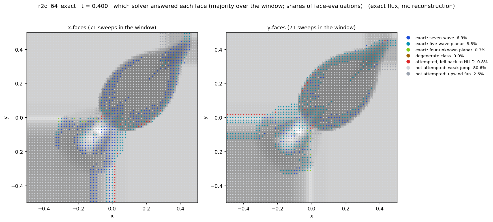

**The solution.** L1 against the 512² HLLD reference (`rotor_compare.py`,
global):

| t | exact 64² | HLLD 64² | exact vs HLLD at 64² |
|---|---|---|---|
| 0.05 | 0.0332 | 0.0441 | 2.5% |
| 0.10 | 0.0541 | 0.0617 | 2.7% |
| 0.20 | 0.0931 | 0.0921 | 2.8% |
| 0.30 | 0.1019 | 0.1055 | 3.1% |
| 0.40 | **0.1019** | **0.1100** | 3.1% |

The first problem where the exact flux moves the solution toward the
reference by a visible amount: 7% of the gap at t = 0.4 (25% at t = 0.05,
while the shear layers and shocks are still sharp), against the rotor's
0.1% and Orszag–Tang's 0.2–2%. The exact flux moves the 64² solution by 3%
here -- the strong initial discontinuities are where a flux function has
something to resolve. The same caveat on the reference as for Orszag–Tang:
135 of its 262,144 cells end with an unconverged recovery, and single cells
in the rarefaction into the low-pressure quadrant (ρ ≈ 2–6e-3) reported
transient Lorentz factors of 25–185 at logged steps (the snapshots show at
most 8.1) -- near-vacuum cells where the recovery's bracket fails and the
velocity is clamped. The exact run reports one or two unconverged cells
from step 248 on (of 4,096), the 64² HLLD run none.

Max Lorentz factor 20.7 in the exact run's last snapshot (the 64² HLLD run
9.3, the 512² reference 8.1), in the rarefaction fan at the low-pressure
corner; density down to 0.010.

#### HLLE, HLLC, HLLD and the exact flux at 64² and 512² (2026-10-07)

The comparison Kiuchi et al. (2022) draw for the hydro problem, made for
the magnetised one: HLLE and HLLC at 64² and 512² beside the HLLD runs and
the exact flux (calea jobs 37750–37753; `SOLVER=hlle` / `hllc` in
`calea_rotor_hlld.sh`). L1(rho) at t = 0.4, each run against the 512² HLLD
reference and against its own flux at 512²:

| flux | 64² vs HLLD 512² | 64² vs own 512² | 512² vs HLLD 512² | 64² wall |
|---|---|---|---|---|
| HLLE | 0.1343 | 0.1310 | 0.0191 | 0.46 s/step |
| HLLC | 0.1120 | 0.1104 | 0.0177 | 0.48 |
| HLLD | 0.1100 | (reference) | — | 1.82 |
| exact | **0.1019** | — | — | 235 |

(L1(p): 0.126 / 0.115 / 0.104 / 0.104; L1(|B|): 0.168 / 0.157 / 0.142 /
0.139, same order.) The order is the one the Riemann solvers' wave content
predicts -- HLLE (two waves) worst, HLLC (the contact restored) and HLLD
(the Alfvén waves too) close together, the exact flux best -- and the
exact flux's gain over HLLD, 7% of the gap, is a third of HLLC's gain over
HLLE. At 512² the three approximate fluxes agree to 1.8–1.9% in L1(rho), a
seventh of any 64² run's distance from them: the flux function still
matters at 512², but the 64²–512² gap is resolution.

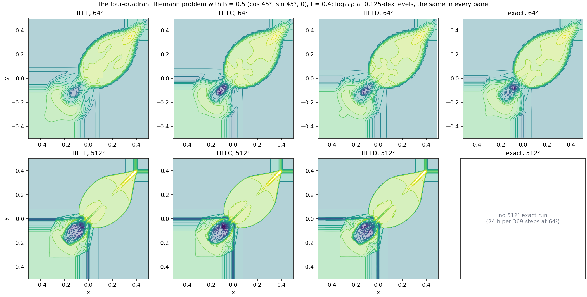

The contours tell the same story as the hydro figure, with the tangential
discontinuities now magnetised: at 512² the shear layers along x = 0 and
y = 0 stay sharp under all three fluxes and the diagonal structure through
the dense lens is one thin line; at 64² every flux spreads the shear layers
to about 16 cells, HLLE most, and none resolves the diagonal.

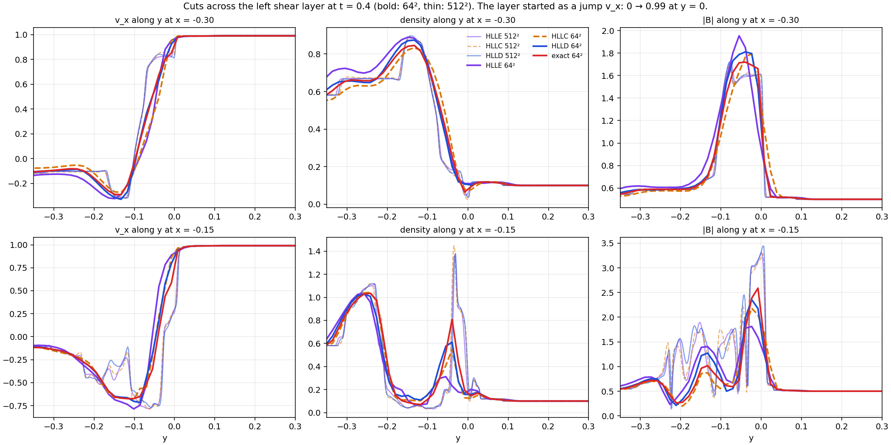

Cuts along y across the left shear layer show where the exact flux earns
its 7%: at x = −0.15 the 512² runs resolve a slow-shock pair with the
contact between them at y ≈ −0.03 (density 1.4, |B| 3.5), and the 64²
fluxes reach it in the L1 order -- density 0.3 (HLLE), 0.5 (HLLC), 0.6
(HLLD), 0.8 (exact); |B| 1.8, 2.2, 2.4, 2.6. The width of the main v_x
transition is the same 0.25 in every run (16 cells at 64², 130 at 512²): by
t = 0.4 it is a fan the waves have opened, not a smeared discontinuity.

Caveats of the 512² runs, as for the HLLD reference: unconverged
recoveries at the end 55 (HLLE), 62 (HLLC), 135 (HLLD) of 262,144 cells,
transient single-cell Lorentz factors up to 58–69 at logged steps in the
near-vacuum rarefaction (the snapshots stay below 16), density minima
0.004–0.013. The HLLE and HLLC runs took 3.1–3.3 h against HLLD's 13.2
(3.8–3.9 s per step against 15.7; HLLD's star-pressure root-find is the
cost).

#### The field tilted out of the plane (2026-10-09)

The same problem with the field tilted 60° out of the plane, `B = 0.5 (cos
45° cos 60°, sin 45° cos 60°, sin 60°)` (`run_2d.py --bz-deg 60`, `BZ_DEG`
in the launchers, runs named `r2dz_`): every face is genuinely non-coplanar,
so the Alfvén rotations are real unknowns and the seven-wave solver works
alone. The 64² exact run took 371 steps to t = 0.4 in 15.4 h (149 s per
step), every rung on and the rescues on the worker pool (calea job 38247;
the first attempts died in the storage outage of 2026-10-08 and the run was
relaunched from scratch).

| | tilted 60° | in the plane |
|---|---|---|
| attempted by the exact solver | 9.5% of faces | 10.4% |
| of the attempted: seven-wave / planar / four-unknown / degenerate | 85.8 / 0.1 / 0.0 / 0.2% | 38.9 / 53.4 / 0.7 / 0.1% |
| left to HLLD | **13.8%** | 7.0% |
| **solved** | **86.2%** (855,306 of 992,172) | 93.0% |

The planar rescues, built for coplanar faces, have nothing to do here, and
the seven-wave solver loses 13.8% of what it is offered (74.5% solved in
the first tenth of the run, 85–88% from the third on). The lost faces are
not physically distinct from the solved ones: the Alfvén–slow and
fast–Alfvén gaps, the contact distance, the magnetisation and the field
rotation have similar distributions (the Alfvén–slow gap a median 2.5e-4
against 1.6e-4, with a heavier tail), and the Lorentz factor is a median
1.4 against 1.3. A third of them (46,947 of 136,698) are seven-wave answers
that converged but were refused as self-crossing fans -- in the coplanar
runs those went to the planar rescue; here nothing takes them -- and the
rest did not converge. Both point at the seven-wave solver's starts and
retries on non-coplanar faces, a different question from the coplanar
problem's missing formulation.

**The waves.** Of the solved faces 85% rotate the field across an Alfvén
wave (in the plane: 0.1%), a third by more than 0.1 rad, 1.2% by more than
π/2. Slow shocks are as common as in the plane (a density jump above 10% on
11.7% of the faces, against 12.1%). The shear faces (tangential-velocity
jump above 0.5 across the face, 2.5% of the solved) rotate the field by a
median 0.34 rad on the left and 0.76 rad on the right, and their shear is
carried by the left slow wave 65%, the right slow wave 19%, the left Alfvén
wave 15% (in the plane 76 / 24 / 0%): the layers are still slow-wave pairs,
now with a real rotational discontinuity inside.

**The solution.** L1(ρ) against the 512² HLLD run of the same problem
(calea job 38011, resumed after the outage as 38248):

| t | exact 64² | HLLD 64² | exact vs HLLD at 64² |
|---|---|---|---|
| 0.05 | 0.0262 | 0.0436 | 2.5% |
| 0.10 | 0.0490 | 0.0612 | 2.7% |
| 0.20 | 0.0855 | 0.0899 | 2.6% |
| 0.30 | 0.0963 | 0.1021 | 2.8% |
| 0.40 | **0.1002** | **0.1058** | 2.6% |

The exact flux closes 5.3% of the gap at t = 0.4 and 40% at t = 0.05,
against 7.4% and 25% in the plane, with 86% of the attempted faces exact
instead of 93%. No unconverged recoveries in the whole run; Lorentz factor
up to 12.1. The snapshots store only the in-plane components, so these
comparisons use ρ, p and the in-plane field.

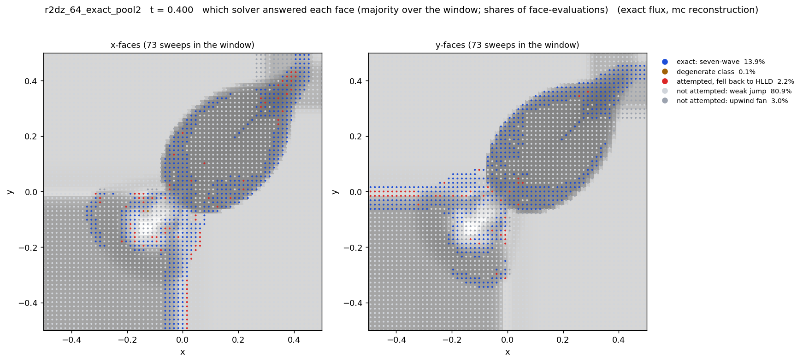

**The worker pool on a whole run.** The run was made three times: with the
rescues in the main process (job 38010, to step 146 when the outage killed
it), with them on the pool (38137, to step 110) and again on the pool after
the outage (38247, complete). The three print identical progress at every
common step, and the first two are bitwise identical over the 85 diag rows
compared before the outage. Wall time at equal steps:

| step | rescues serial | on the pool | |
|---|---|---|---|
| 20 | 1,772 s | 816 s | 2.2x |
| 60 | 6,236 s | 3,042 s | 2.1x |
| 110 | 15,586 s | 8,523 s | 1.8x |
| 146 | 26,538 s | 14,108 s | 1.9x |

The two pooled runs agree to the second. The rescues are still offered
to every face the seven-wave solver loses, and on a non-coplanar face each
of them runs its Newton before refusing the answer as not planar; that is
the work the pool spreads here. Since 2026-10-09 a planarity check skips
it (`RMHD_PLANAR_PRECHECK`, default on): no planar rung can accept a lane
whose input is not planar to 1e-6, and each refused one only after its
Newton. Measured on this run's busiest phase, resumed from its final restart
for 8 steps on one node (calea job 39291): 2,092 s without the check, 433 s
with it -- **4.8x** -- with the diag rows bitwise identical. On coplanar
problems nothing changes: every lane passes the check.
---

## Reproducing the numbers

| section | command |
|---|---|
| coverage bitmasks | `scripts/harvest_summary.py results/rotor_64_p5/harvest` |
| run comparison | `scripts/rotor_compare.py results/rotor_64_p5 results/rotor_128_hlld` |
| a solved profile | `scripts/plot_riemann_profile.py` |
| a π-rotation profile | `scripts/plot_pi_rotation.py` |
| planar-solver claims | `scripts/measure_planar_claims.py results/rotor_64_exact/harvest` |
| failure map (5) | `scripts/failure_map_2d.py results/rotor_64_exact --out figs/failure_map` |
| snapshot census (5) | `sbatch scripts/calea_snapshot_census.sh` (from `ssh itp`; writes `results/snapshot_census_64`) |
| compound classifier and maps (5) | `scripts/compound_classifier.py results/snapshot_census_64 --run results/rotor_64_exact --maps figs/census` |
| the routing replay (5) | `RMHD_COMPOUND_SKIP=1 REPLAY_OUT=on.npz scripts/rotor_replay.py replay x <tag>` against the same recording without the flag |
| the reconstruction study (7) | `N=<n> LIMITER=<limiter> sbatch scripts/calea_rotor_hlld.sh` for each run (limiter pcm, mc, mp5, mp7 or weno5z; calea `results/`, see `results/recon_study_2026-09/README.md`), then `scripts/recon_study.py --ref <512^2 run> --runs <runs> --plot figs/rotor_output/recon_study.png --failed mp5:512 mp7:512` |
| secant vs Newton for the HLLD p* (7) | `scripts/pstar_methods.py results/rotor_128_hlld_mc --times 0.1,0.25,0.4` |
| the rotor's state and solver map (7) | `scripts/plot_rotor_output.py <run> --out figs/rotor_output` |
| which solution a scheme picks (5) | `scripts/compound_wave.py --balsara1 --flux hlle --limiter mp5 --ncells 1024 2048 4096` |
| the weak-jump gate replayed, and the linearised flux against it (4c) | `scripts/weak_gate_study.py <rec> pfd pfe --tau 1e-3 0 --out <dir>`, then `--linear --from-saved` |
| 1D tubes, weak regime (4c) | `scripts/shocktube_compare.py configs/mignone/st1.yaml --solvers hlld,linear,exact --shrink 0.03` |
| the failure ledger (5a) | `sbatch scripts/calea_failure_ledger.sh` (from `ssh itp`; writes `ledger.txt`, `cards.txt`, `cards.csv`) |
| a switch, paired against the ledger's recordings (5a) | `RMHD_FAST_EDGE_SCAN=1 scripts/failure_ledger.py collect <rec> pfa pfb pfc --paired --out <npz>` |
| which wave fails, the fast-shock root pairs, the slow family's tangent (5a) | `scripts/ledger_subwaves.py results/failure_ledger_64 --pairs --slow-family` |
| the four-unknown rung, paired (5a) | `RMHD_PLANAR4=1 scripts/failure_ledger.py collect <rec> <tags> --paired --out <npz>` |
| the defaults' run: tally, solution, cost (5a) | `scripts/harvest_summary.py results/rotor_64_exact_defaults/harvest`; `scripts/rotor_compare.py results/rotor_64_exact_defaults results/rotor_512_hlld --regions`; a rung's cost: `RMHD_WEAK_FLUX=hlld RMHD_PLANAR5_LADDER=0 scripts/failure_ledger.py collect <held-out rec> pfd pfe --paired --out <npz>` timed, one configuration per call |
| Orszag–Tang (7): the runs | `PROBLEM=orszag_tang N=64 sbatch scripts/calea_rotor_exact.sh`; `PROBLEM=orszag_tang N=64` and `N=512 TORCH_THREADS=24 sbatch scripts/calea_rotor_hlld.sh` |
| Orszag–Tang (7): recorded windows | `PROBLEM=orszag_tang N=64 T0=<t> NSTEP=2 REC_DIR=<dir> scripts/rotor_replay.py record <tag>`, then `failure_ledger.py collect <dir> <tags> --paired` (the recording carries gamma) |
| the four-quadrant problem (7): the runs | `PROBLEM=riemann2d N=64 sbatch scripts/calea_rotor_exact.sh` (B0 sets the field); `PROBLEM=riemann2d N=64` and `N=512 TORCH_THREADS=24 sbatch scripts/calea_rotor_hlld.sh` |
| the four fluxes at two resolutions (7) | the same with `SOLVER=hlle` and `SOLVER=hllc`; `scripts/rotor_compare.py results/r2d_64_<flux> results/r2d_512_hlld` per pair; the contour panel and the cuts were drawn from the final snapshots (levels at 0.125 dex; cuts along y at x = −0.3 and −0.15) |
| the field tilted out of the plane (7) | `PROBLEM=riemann2d BZ_DEG=60 N=64 sbatch scripts/calea_rotor_exact.sh`; the references with `calea_rotor_hlld.sh` at N=64 and N=512 (TORCH_THREADS=24) |
| the recovery's creeping secant (7) | `pytest tests/test_c2p.py` (the hot-fast-gas and bitwise tests); the random-batch census is the module docstring's recipe |
| the four-unknown pilot (5a) | `scripts/pilot_four_unknowns.py results/failure_ledger_64 1394,719,1816` (samples: `--quiet`; calea, the numpy kernels are too slow for more than a lane) |
| one planar Newton, iteration by iteration (5a) | `scripts/newton_trace.py results/failure_ledger_64 --lanes 719,1394` |
| 128^2 census (5) | `RUN=results/rotor_128_exact TAG=128 sbatch scripts/calea_snapshot_census.sh` |
| tube-resolution check (5) | `NSHARDS=1280 TAG=64_res512 EXTRA="--ncells 512" sbatch scripts/calea_snapshot_census.sh` |

The census, hierarchy, rotation and rarefaction measurements were run from
session scripts on 2026-09-09; the numbers and their method are stated above
in enough detail to rebuild them, and the population is
`results/rotor_64_exact/harvest` in every case.
